# ORRERY

> English version: [README.en.md](README.en.md)

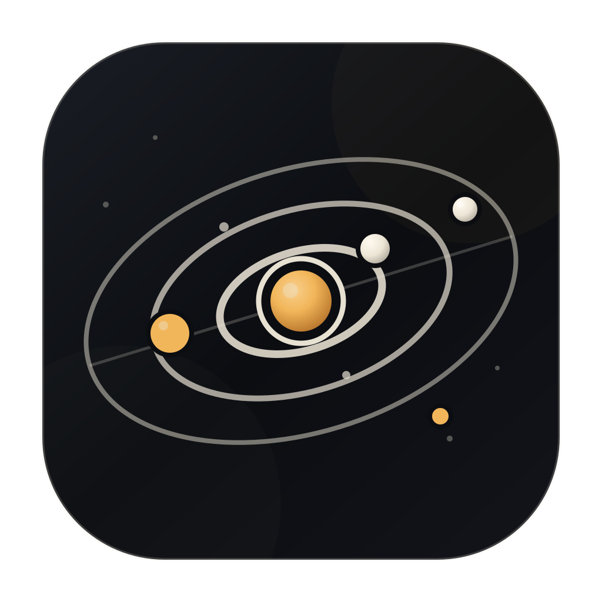

ORRERY は、複数の Claude Code / Codex の agent をチームとして動かす人のための cockpit です。どの agent が返事を待っているかを窓から窓へ探し回る必要はありません。何体動かしていても、人の判断を待っている agent だけが roster で点滅して一目で分かり、全員の端末・agent 同士のやり取り・残りの利用枠を一つの画面で見渡しながら、そのまま指示を送れます。Mac（`ORRERY.app` とブラウザ）と Windows（WSL2 とブラウザ）で使え、[ORRERY Telemetry](https://github.com/gyroid-eth/orrery-telemetry) と連携します。

## クイックスタート

ORRERY は 2 つでできています。**cockpit**（この repository。端末を並べて操作する画面）と、裏で agent と Mail を動かし Telemetry 画面を出す [ORRERY Telemetry](https://github.com/gyroid-eth/orrery-telemetry) です。**次の 1 行で両方入ります。** Mac のターミナル、または Windows の WSL2 Ubuntu 内で実行します。

```bash
curl -fsSL https://raw.githubusercontent.com/gyroid-eth/orrery/master/scripts/get.sh | bash
```

表示される計画を読んで承認し、doctor と Mail の selftest が成功したことを確かめます。Claude Code か Codex CLI を同じ OS 環境でログイン済みにしてから、表示された cockpit の URL（既定は `http://127.0.0.1:8791/cockpit.html`）を開きます。CLI が無ければ installer の完了だけでは agent を動かせません。前提条件、変更する設定、手動での導入は[インストール](docs/install.md)を参照してください。

### 入るものと置き場所

| 場所 | 中身 |
| --- | --- |
| `~/orrery` | cockpit の source（起動・更新の script） |
| `~/orrery-telemetry` | Telemetry・Mail・hook・installer の source。実際に動くのは `~/.agentstack` に入れた方 |
| `~/.agentstack` | 実際に動いている本体、設定 `env.sh`、Mail の DB |
| `~/orrery-work` | agent の作業 folder（project folder）。ORRERY の指示を書いた `CLAUDE.md` が入る。Mail と予約はこの単位 |

port は cockpit が 8791、Telemetry が 8770、Mail が 18765 です。`ORRERY.app` は、8791 の cockpit を開く窓です。作業 folder の変え方と消し方は[作業 folder と消し方](#作業-folder-と消し方)にあります。

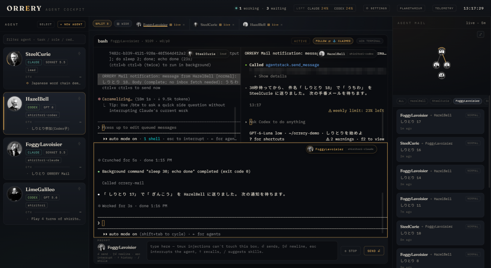

左の roster で agent を選び、中央の端末で指示し、右の mini-orrery と Mail で親子関係とやり取りを追います。端末だけなら ORRERY Telemetry が止まっていても使え、連携する機能は状態を表示して縮退します。

**紹介動画**: 「Orrery」（約 90 秒・日本語）は、agent どうしが直接話すことで AI の間の仲介が要らなくなる、という ORRERY の考え方を図解で説明する動画です（実際の画面ではありません）。

[](https://youtu.be/JXoa93TQolU)

## できること

### 打っている途中で流されない

たくさんの agent を同時に動かしていると、親の agent の端末に指示を打っている途中で、他の agent からの通知が同じ端末に流れ込み、書きかけの文が埋もれてしまいます。cockpit では、指示は端末の下にある別の入力欄（composer）に打つので、端末に何が流れてきても書きかけはそのまま残ります。送り先は、roster や tab で agent をクリックするだけで切り替わり、文はそのまま持ち越されます。

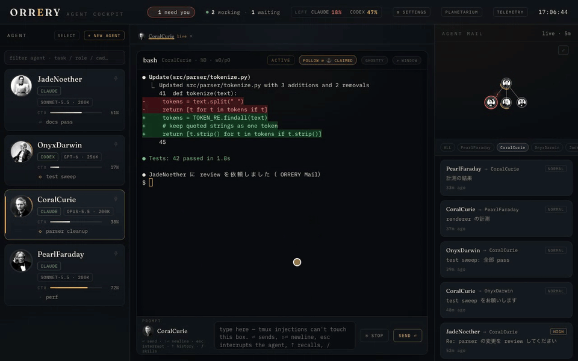

→ [使い方: Prompt composer](docs/usage.md#prompt-composer)

### 人の判断が要る agent が一目で分かる

何体の agent を動かしていても、手が止まって人の判断を待っている agent だけが roster で光り（承認待ちは赤く点滅、質問待ちは水色でゆっくり明滅）、header に `N need you` が出ます。`need you` を押すとその agent だけに絞られ、tile をクリックすればその端末に入って質問を読めます。composer から答えを送れば点滅は消えます。人の判断が要る agent を探し回らず、止まった順に片付けられます。

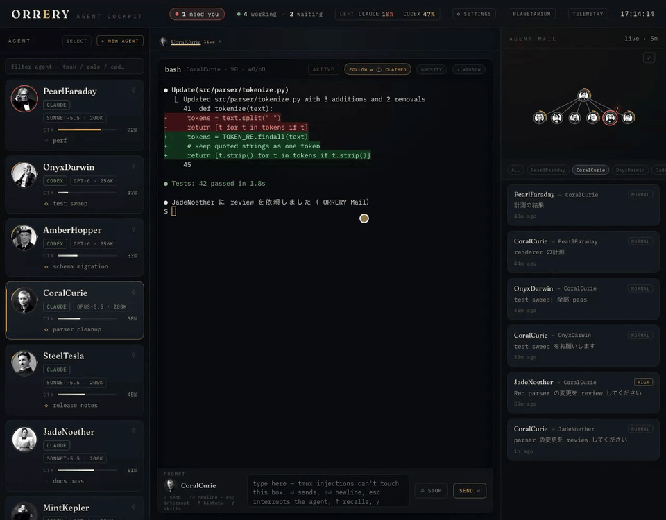

TELEMETRY でも同じく、質問待ちは `?`、承認待ちは赤い枠と `APPROVAL` で見分けられます。

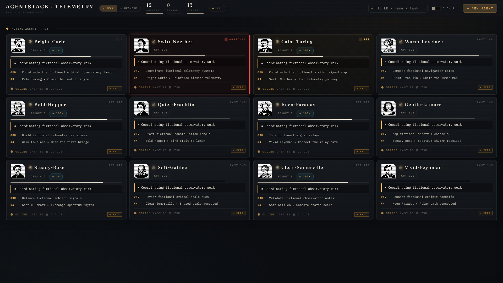

→ [使い方: 人の判断が要る agent](docs/usage.md#人の判断が要る-agent)・[介入待ちの見分け方（TELEMETRY）](docs/usage.md#介入待ちの見分け方)

### agent 同士が何を話しているかを、その場で読める

agent は ORRERY Mail で互いに依頼し、報告し、指摘し合います。その Mail が右の rail に新しい順に流れてくるので、端末を一つずつ開かなくても、チームの会話をその場で読めます。card をクリックすると本文が、`thread` を押すとその話の往復が時系列で開きます。roster で agent を選ぶと、その agent が関わる Mail だけに絞られます。

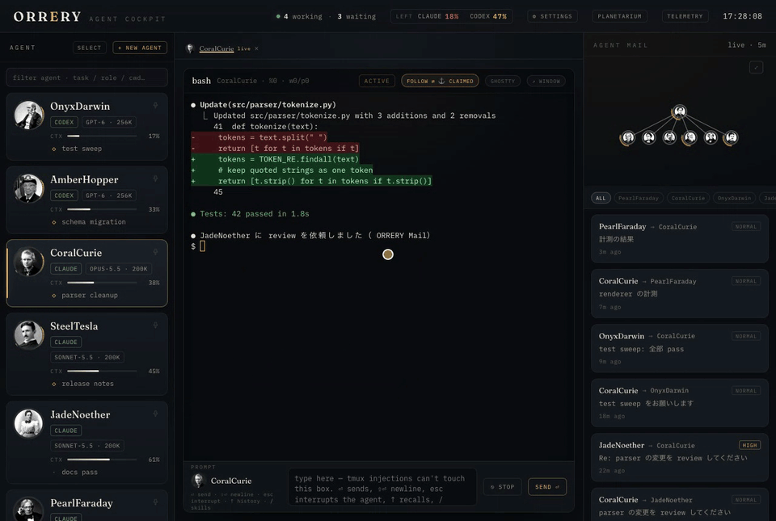

→ [使い方: Agent Mail](docs/usage.md#agent-mail)

### よく見る agent を上に固定する（Pin）

何体も動いていると、roster は状態（承認待ち・作業中・待機）の順に並び替わり続けます。親の agent やレビュー役など、いつも見る agent を pin すれば、並び替えに関係なく一番上に留まり、区切り線の上にまとまります。tile に mouse を乗せて右上の pin を押すだけで、もう一度押せば外れます。pin は ORRERY.app とブラウザの tab の間で共有され、agent が retire すると自動で外れます（pin があるのは左の roster だけです）。

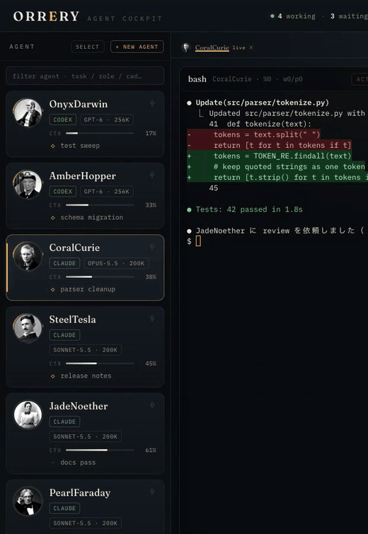

→ [使い方: Pin](docs/usage.md#pin)

### 複数の端末を並べる（Split）

`Cmd` / `Ctrl` を押しながら agent を選ぶと、最大 12 体の端末を一つの画面に並べられます。名札を drag すると位置を入れ替え、境目を drag すると幅を変えられます。親の agent と、その子たちの進み具合を同時に見張れます。

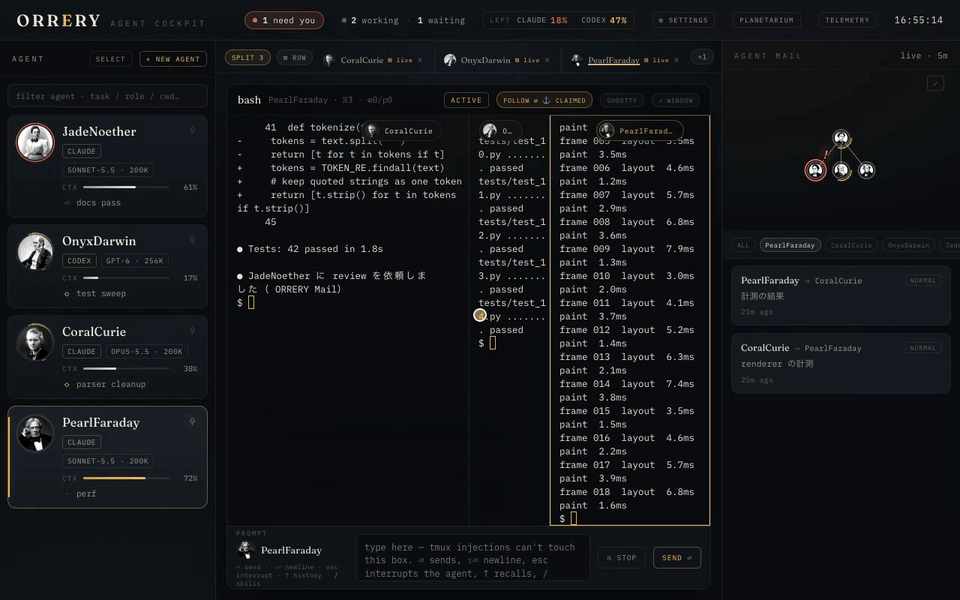

→ [使い方: Split](docs/usage.md#split)

### 一つの端末を外に出す（独立の窓）

tab の名札を端末の上へ drag すると、cockpit の上に浮かぶ小さな窓になります（`FLOAT`）。そのまま cockpit の外へ出すか `↗` を押すと、独立の窓になり（`WINDOW`）、別のモニターに置いて大きく見られます。窓を閉じれば元の tab に戻ります。ORRERY.app でも、Mac と WSL のブラウザでも使えます。

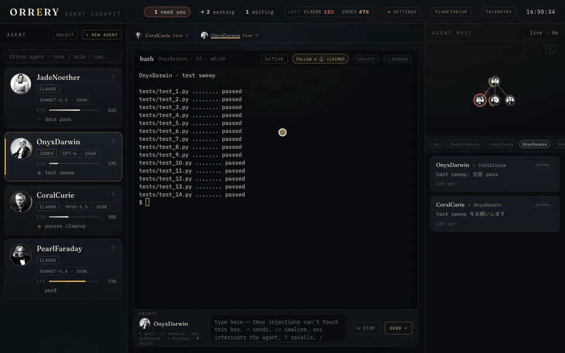

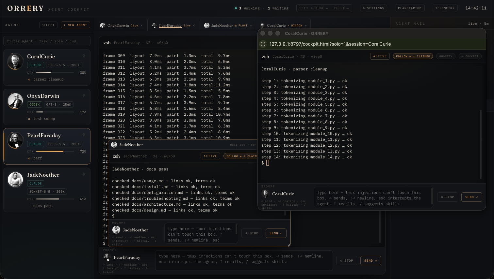

→ [使い方: 独立の窓](docs/usage.md#独立の窓)

### 端末から開く・端末に渡す

agent が端末に出した URL はクリックで既定のブラウザに、ファイルのパスはクリックで Finder（Windows ではエクスプローラー）に開きます。逆に、Finder（Windows ではエクスプローラー）でコピーしたファイルを composer に貼ると、その絶対パスが入り、そのまま agent に渡せます。スクリーンショットの画像を貼ると、Mac では agent の CLI がそのまま受け取り、Windows（WSL2）では画像を保存してそのパスが入ります。

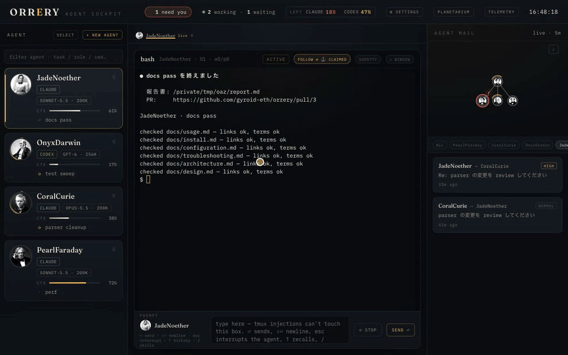

→ [使い方: 端末から開く・端末に渡す](docs/usage.md#端末から開く端末に渡す)・[WSL でのファイル・画像の貼り付け](docs/usage.md#wsl-でのファイル画像の貼り付け)

### 明るい配色（light mode）

Settings の Color theme で、暗い配色（Dark）と、紙のような明るい配色（Light）を切り替えられます。端末の中の色や、埋め込みの TELEMETRY まで一緒に変わり、diff の赤と緑の背景の上でも文字が読める濃さに補正します。`System` にすると OS の外観に合わせます。

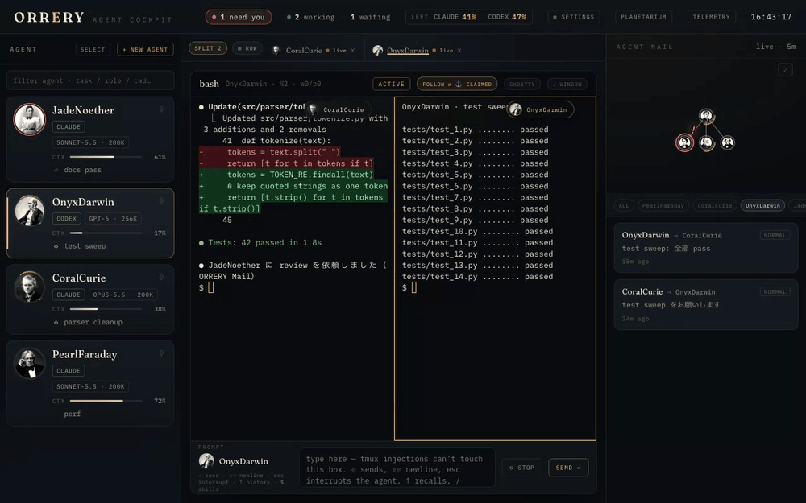

→ [使い方: 配色テーマ（light mode）](docs/usage.md#配色テーマlight-mode)

### 画面のユーザー名を伏せる（デモモード）

録画・ライブのデモ・画面共有のために、画面に出るユーザー名と機体名を `********` のように伏せられます。Settings の Demo mode を入れるか、URL に `?demo=1` を付けます。roster・tooltip・Mail・Planetarium・埋め込みの TELEMETRY・端末の中身まで伏せ、画面の隅に `DEMO` と出ます。伏せるのは表示だけで、端末の中の path や URL をクリックしたときと、コピーした文字は本当の値です。Mail に書かれた人の名前なども伏せたいときは、Settings の「Also mask these words」に語を足します。

→ [設定: 保存データとプライバシー](docs/configuration.md#保存データとプライバシー)

### 利用枠の残りを見る（残量表示）

header の `LEFT` に、Claude と Codex のアカウントの利用枠があと何 % 残っているかが出ます。クリックすると、5 時間の枠・週の枠・モデル別の枠を、reset までの時間つきで並べます。数字は緑・黄・赤で変わり、取れないときは理由を出します。

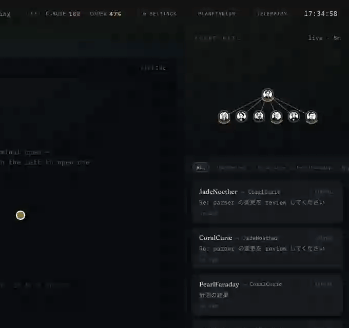

→ [使い方: Usage（残量表示）](docs/usage.md#usage残量表示)

### 名前をコピーする・詳細を見る（Roster）

roster の tile に mouse を乗せると、名前をコピーする icon が出ます。コピーした名前は Mail の宛先や指示文にそのまま貼れます。tile の詳細 card には、最後に動いた時刻や成果物の数が並びます。

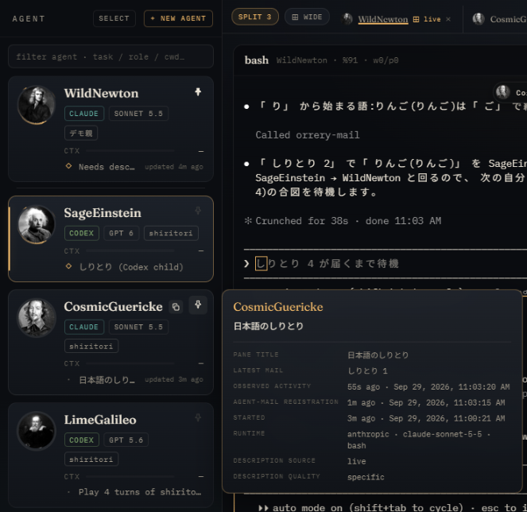

→ [使い方: Roster](docs/usage.md#roster)

### 親子関係と通信を見渡す（Planetarium）

header の `PLANETARIUM` で、誰が誰を起動したかの木を画面いっぱいに開きます。直近 90 秒に Mail が行き来した二者の間には線が光り、Mail が届くたびに彗星が飛ぶので、チームのどこで会話が起きているかが一目で分かります。node をクリックすると、その agent の端末へそのまま移ります。

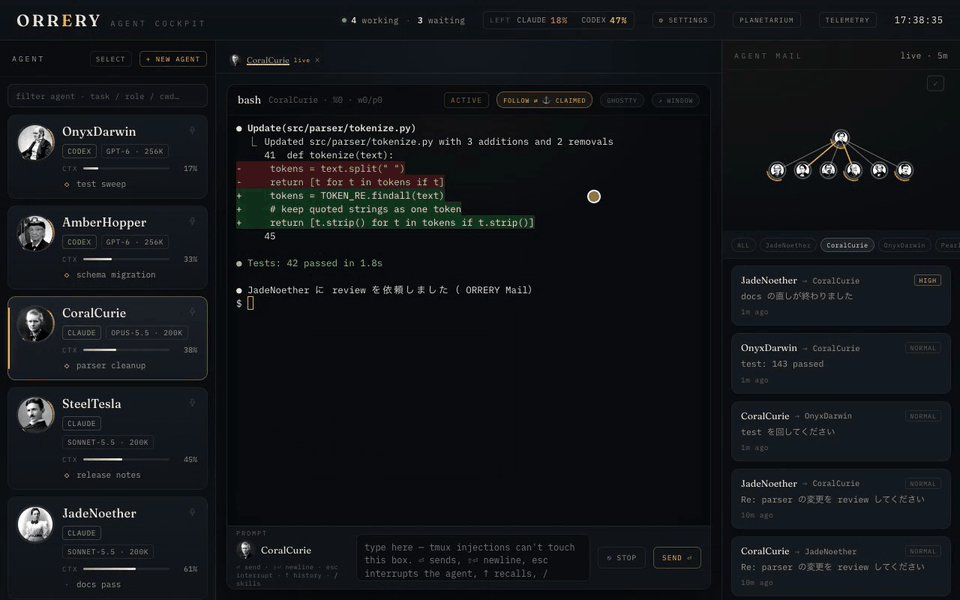

→ [使い方: Planetarium](docs/usage.md#planetarium)

### チーム全体の状態を見る（TELEMETRY）

header の `TELEMETRY` で、ORRERY Telemetry の dashboard を cockpit の中に開きます。`DECK` は agent ごとの card、`NETWORK` は agent 同士のつながりを node と線で見せ、agent を選べば会話と tool の履歴、成果物の一覧も読めます。`OPEN IN COCKPIT` を押すと、その agent の端末にそのまま戻ります。別の画面に行かずに、cockpit の中でチーム全体を見渡し、そのまま手元の端末へ戻れます。終了した agent の再開もここから行います。

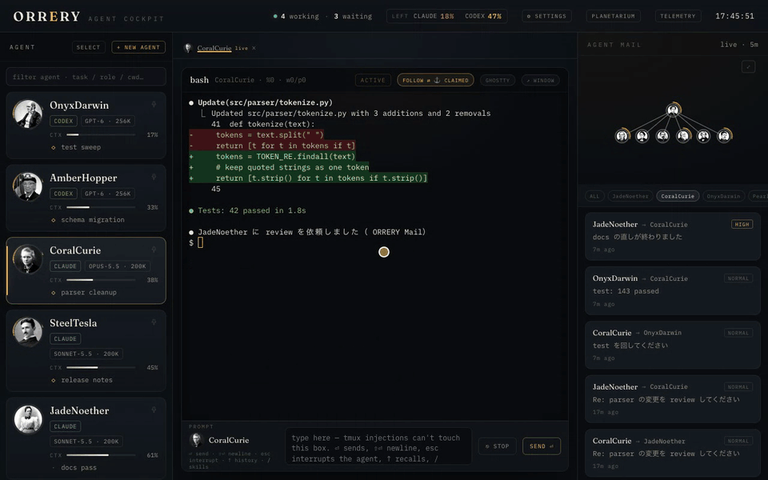

**REPLAY**: 仕事が終わった後に、チームが何をどの順でやったかを、録画のように見直せます。NETWORK で `SELECT` を押して agent を選び `Replay` を押すと、選んだ agent の履歴が時間軸で再生され、誰が誰を起動し（spawn）、どんな Mail を送り合ったかが、件名つきで順に現れます。速さの目盛りで早送りし、下の時間軸をクリックすれば好きな時刻に飛べます。

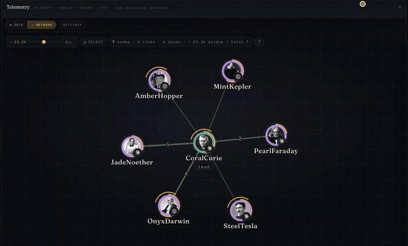

→ [使い方: TELEMETRY](docs/usage.md#telemetry)

### Obsidian と一緒に使う

Obsidian の vault の中で agent を動かすと、作業ログ・論文ノート・タスクがそのまま Markdown のノートになり、人は Obsidian の Daily Note と Kanban で見るだけで済みます。agent が端末に出したノートのパスは、cockpit でクリックすれば開けます。ORRERY は Obsidian が無くても使えます。これは便利な使い方の 1 つです。

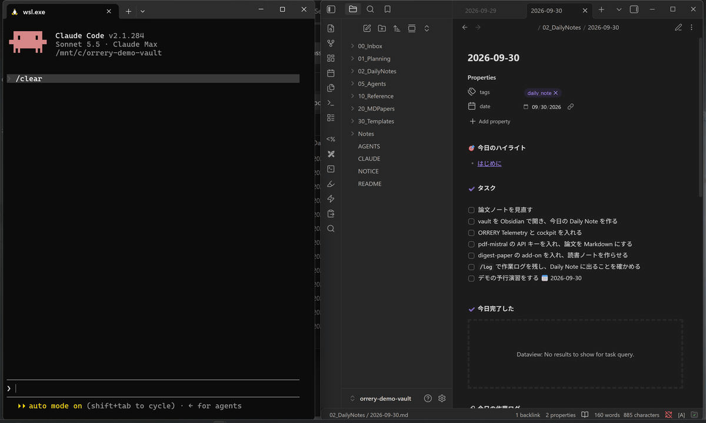

→ [Obsidian と一緒に使う](https://github.com/gyroid-eth/orrery-telemetry/blob/master/docs/obsidian.md)（ORRERY Telemetry の文書）・すぐ試せるひな形 [orrery-demo-vault](https://github.com/gyroid-eth/orrery-demo-vault)

論文の読書ノートは、add-on の [orrery-digest-paper](https://github.com/gyroid-eth/orrery-digest-paper) が作ります。Claude が書き、Codex が本文と図に照らして確かめます（Zotero を使う人向けの版もあります）。add-on と demo vault は [研究セットの 1 行](docs/research-set.md) でまとめて入ります。

### Windows（WSL2）でも同じ画面で

WSL2 で backend を動かし、Windows のブラウザで開けば、Mac と同じ画面を使えます。shortcut は `Alt+K` などに、外で開く端末は Windows Terminal に、リンクの開き先は Windows のブラウザとエクスプローラーに切り替わります。エクスプローラーでコピーしたファイルやスクリーンショットも、composer に貼ればパスとして agent に渡せます。

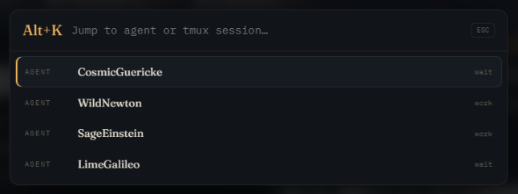

→ [使い方: Windows（WSL2）での違い](docs/usage.md#windowswsl2での違い)

### ほかにできること

- agent と tmux session を検索して、その端末へ移る（`Cmd+K` / WSL は `Alt+K`）
- composer から送信。送信履歴、`/` か `$` で skill と command の候補、session を消す command や記号の取り違えを送る前に止める送信ガード（[Prompt composer](docs/usage.md#prompt-composer)）
- cockpit から ORRERY Telemetry の NEW AGENT と一括 EXIT（[NEW AGENT](docs/usage.md#new-agent)）
- 小さい文字と字間の調整（Vision profile。[配色テーマ](docs/usage.md#配色テーマlight-mode)）

## 動作要件

- macOS、または Windows の WSL2（Ubuntu）。`ORRERY.app` とその installer、global hotkey は macOS だけ
- Python 3.10 以上、`tmux`
- Node.js / npm、Rust / Cargo（desktop app の開発・build 時）
- Homebrew で入れた `tmux` が見つからない Mac では、`brew shellenv` を shell に設定して `/opt/homebrew/bin` を PATH に通す（installer が `tmux` を「Missing」と言うのは、これが無いときです）
- 稼働中の [ORRERY Telemetry](https://github.com/gyroid-eth/orrery-telemetry)（全連携機能を使う場合）
- ORRERY Mail SQLite（mail rail を使う場合）
- runtime CDN への接続（`xterm.js` と addon。現行配布は完全 offline bundle ではありません）

詳細と役割別の要件は[インストール](docs/install.md)を参照してください。

## 作業 folder と消し方

### 作業 folder を変える

install の 1 行に `--project-key` を足します。後から変えるときも、同じ 1 行に `--project-key` を付けて実行し直します。

```bash
curl -fsSL https://raw.githubusercontent.com/gyroid-eth/orrery/master/scripts/get.sh | bash -s -- --project-key ~/my-project
```

- 古い folder の `CLAUDE.md` の ORRERY の block は残ります。要らなければ marker の間を手で消します。
- Mail は project 単位です。変える前に起動していた agent は Telemetry に出続けますが、古い project のままで、新しい agent と Mail が通じません。EXIT して起動し直してください。
- `+ NEW AGENT` の folder の候補（未設定なら `~`）は別の設定です。`cd ~/orrery-telemetry && ./scripts/install.sh --spawn-dirs "$HOME/a:$HOME/b"` で変えます（project key は引き継がれます）。
- **terminal で直接 `claude` を起動すると、その場の folder で動き、ORRERY の指示が入っていません。** `/delegate` が使われず、親子の線も出ません。agent は `+ NEW AGENT` か `~/.agentstack/bin/agent-start <作業 folder>` で起動します。

### 完全に消す

`agentstack-uninstall` が消すのは `~/.agentstack` の中（と service、settings の変更）だけです。source・作業 folder・uv は残ります。

```bash
~/.agentstack/bin/agentstack-uninstall --dry-run      # 先に確認
~/.agentstack/bin/agentstack-uninstall --purge-data   # Mail の DB も消す（残すなら付けない）
# cockpit を動かしている窓で Ctrl-C（ORRERY.app は終了）
rm -rf ~/orrery ~/orrery-telemetry
```

作業 folder（`~/orrery-work` など）は自分の仕事の場所なので、消すかどうかは自分で決めます。入れた `uv` は `~/.local/bin` に残ります。

## 画面のガイドで始める

1. **Your first flight** — 初回に右側へ出る7項目のガイドを通します。agent の起動、選択、入力など、画面の説明どおりに操作すると ✓ が付きます。Mail を読んだ項目は `Mark as read` で確認します。閉じたガイドは `Settings → Getting started → Your first flight` から開けます。
2. **Show help map** — 同じ `Getting started` の `Show help map` を押し、主要な部品の注記を見ながら画面を見回します。`Esc` または画面のクリックで閉じられます。
3. **Full tour** — 同じ場所の `Full tour` で16段の操作を順に試します。子とのしりとり、端末の配置、Telemetry の EXIT / RESUME、NETWORK / REPLAY から端末への帰還までを案内します。ゲームはガイドの ✓ が付いた後も3往復まで終えます。進行は最初のガイドとは別に保存されます（[Full tour の説明](docs/FULL_TOUR.md)）。

普段の操作は、画面内のガイドと help map から始めてください。操作の詳しい参照は[使い方](docs/usage.md)、表示や接続が合わないときは[トラブルシューティング](docs/troubleshooting.md)へ進みます。ガイドで起動する agent は CLI のアカウント利用枠を消費します。

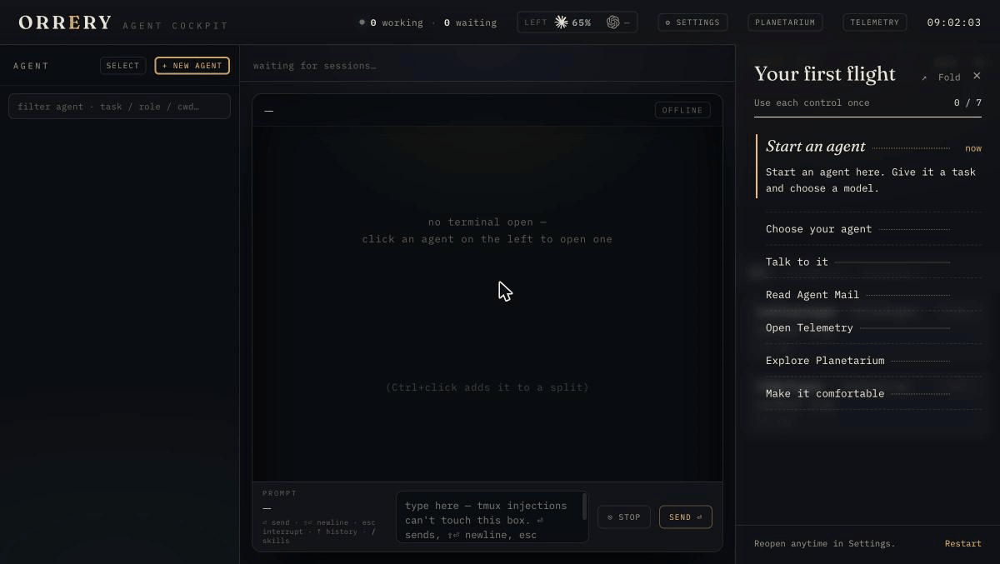

## 更新・手動導入

更新も上の1行から行えます。cockpit の folder で `./scripts/update.sh` を実行する方法や再起動の条件は[更新手順](docs/install.md#5-更新する)を参照してください。

手動での clone・venv・backend の起動、Telemetry と同じ project key / Mail DB の設定、desktop app の build と sidecar の設定は[インストール](docs/install.md)と[設定](docs/configuration.md)にまとめています。

## ドキュメント

目的から探すときは[全 docs の索引](docs/README.md)へ。

日本語文書が正本です。英語版は [README.en.md](README.en.md) と `docs/en/` にあり、この表のすべての文書に対応する英語版があります。

| 文書 | 内容 |
| --- | --- |
| [インストール](docs/install.md) | 要件、venv、ORRERY Telemetry との接続、backend、`ORRERY.app` |
| [設定](docs/configuration.md) | 環境変数の全数、既定値、接続先と保存先 |
| [使い方](docs/usage.md) | roster、terminal、split、spawn、mail、TELEMETRY、replay |
| [トラブルシューティング](docs/troubleshooting.md) | 起動、port、`:8770`、`pyte`、tmux、CDN |
| [アーキテクチャ概要](docs/ARCHITECTURE_OVERVIEW.md) | tmux、Codex App、network、データ保持、肖像画像の扱い |
| [実装アーキテクチャ](docs/ARCHITECTURE.md) | backend、HTTP / WebSocket、tmux 制御の詳細 |
| [デザイン言語](docs/DESIGN.md) | cockpit の視覚・motion・色・typography |

## 構成

```text
ORRERY.app / browser
        │ HTTP + WebSocket (:8791)
        ▼
ORRERY Python backend
  ├─ tmux control mode ── local agent sessions
  ├─ read-only SQLite ─── ORRERY Mail
  └─ HTTP proxy ───────── ORRERY Telemetry dashboard (:8770)
```

ORRERY backend は ORRERY Telemetry の `server.py` を import せず、HTTP proxy と独自の tmux / mail / portrait handler で連携します。端末入力、window size の claim、spawn、EXIT は状態を変更する操作です。単なる read-only viewer ではありません。

## セキュリティとプライバシー

backend は `127.0.0.1` だけに bind し、外部 bind を拒否します。ただし localhost 上の認証機構はないため、信頼できないローカルプロセスがある環境では起動しないでください。

terminal recorder は既定で `~/.orrery/history` に履歴を保存し、prompt の draft と最大50件の送信履歴は browser の `localStorage` に残ります。機密情報を入力する運用では、保存先と保持方針を[設定](docs/configuration.md#保存データとプライバシー)で確認してください。

## 第三者コンポーネント

ORRERY は ORRERY Telemetry、`tmux`、`xterm.js` などと連携します。この repository は ORRERY Mail のコードを含みません。ORRERY Mail のライセンスと第三者 notice は [ORRERY Telemetry](https://github.com/gyroid-eth/orrery-telemetry) を参照してください。

`assets/portraits/`・`assets/portraits_64/` の肖像画像は PolyForm Perimeter License の対象外です。各画像のライセンス（public domain、CC0、CC BY 4.0、CC BY-SA 2.0 / 4.0）、作者、出典、加工内容は [CREDITS.md](CREDITS.md) に従います。CC BY-SA の画像は、加工後の画像も同じ CC BY-SA で提供します。manifest / CREDITS にない portrait は配布承認済み asset とみなしません。ただし `assets/portraits_px/` のドット絵 50枚は、作者 gyroid が ChatGPT（OpenAI の画像生成）で文章の指示だけから生成したものです。写真は入力に使っていません。repository と同じ条件（PolyForm Perimeter License 1.0.1）で配布します。

## ライセンス

本 repository は **PolyForm Perimeter License 1.0.1** です（肖像画像を除く。[第三者コンポーネント](#第三者コンポーネント)を参照）。source-available であり、OSI の意味での open source ではありません。全文は [LICENSE](LICENSE) を参照してください。© 2026 gyroid.

- 利用・改変・再配布は目的を問わず可能です
- ただし**本ソフトウェアと競合する製品を他者へ提供すること**はできません。無償配布・別言語への移植・service / library / plug-in としての提供も競合に含まれます
- 無保証です。サポートの提供は約束しません

## 不具合の報告

不具合は GitHub repository の Issues へ報告してください。task 名、再現手順、ORRERY / ORRERY Telemetry の起動 log、`/telemetry/health` の結果を添えると切り分けが早くなります。
