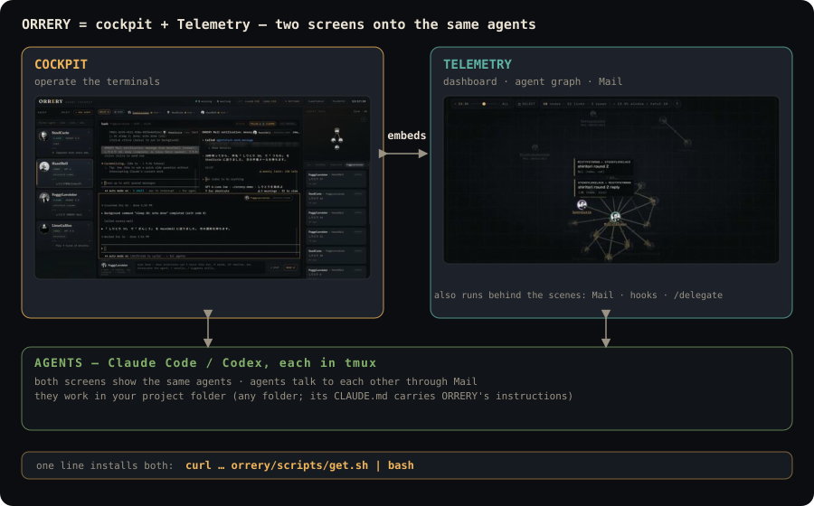

# アーキテクチャ概要

> English version: [en/ARCHITECTURE_OVERVIEW.md](en/ARCHITECTURE_OVERVIEW.md)

[前: トラブルシューティング](troubleshooting.md) · [README に戻る](../README.md) · [次: 実装アーキテクチャ](ARCHITECTURE.md)

この文書は、ORRERY が tmux・Codex App・network・手元のデータ・肖像画像をどう扱うかをまとめます。route と内部実装の詳細は[実装アーキテクチャ](ARCHITECTURE.md)、視覚仕様は[デザイン言語](DESIGN.md)にあります。

ORRERY は、terminal を操作する画面の cockpit と、dashboard と agent graph の画面の Telemetry の 2 つでできています。cockpit は Telemetry の画面を埋め込めます。agent は tmux の中で動き、どちらの画面からも見え、Mail で話します。

## tmux との取り決め

agent name と tmux session name の一致が roster jump の前提です。

backend startup は live session ごとに recorder 用の control-mode connection を一つ接続します。単一 connection で全 session を multiplex する構成ではありません。browser client の pane attach は利用者が tile / palette を選んだ時点で遅延実行します。

通常 agent session で許可する操作:

- attach / detach
- terminal input
- resize / refresh
- viewport claim / follow

WebSocket protocol の pane `split` / `close` は `orrery-` prefix の管理 session だけに許可され、最後の1 paneは close しません。cockpit の複数 session Split は非破壊の表示 layout です。

Claim は tmux window の grid size を変更し、同時に開いている external client にも影響します。ORRERY は window ごとの初回 Claim 直前に、local `window-size` option の有無と値、正確な grid size を snapshot します。Follow は ORRERY-owned の distinct window すべてを各 snapshot へ戻し、最後の peer detach / disconnect と teardown も tracked window だけを復元します。

Claim しない plain attach / detach は外部の manual 設定を変更しません。restore に失敗した snapshot は成功するまで保持して後続経路で再試行し、teardown でも残れば backend log に session 名と window ID を記録します。

## Codex App

ORRERY は Codex App snapshot file を直接読みません。任意の orrery-telemetry の Codex App Bridge が dashboard `/api/agents` に統合した row を表示します。

Codex App runtime は tmux pane を持たないため、cockpit terminal から操作できません。embedded dashboard では ChatGPT app を前面化する `open` capability だけを利用します。cold wake と delivery は Bridge の責務です。

## Network と offline の条件

frontend は runtime に jsDelivr から `xterm.js 5.5.0` と `addon-fit 0.10.0`、Google Fonts を読みます。network がない場合、font は fallback し、xterm script が取得できなければ terminal UI は成立しません。現行配布は完全 self-contained bundle ではありません。

backend は localhost-only ですが認証 layer を持ちません。`/api/*` proxy、terminal input、spawn、EXIT、mail body、local directory browser を remote tunnel や reverse proxy で公開しないでください。

## データと保持

| データ | 保存先 | 保持 |
| --- | --- | --- |
| terminal recorder | `ORRERY_HISTORY_DIR`、既定 `~/.orrery/history` | 通常7日、orphan 24時間 |
| pane history | recorder JSON | 最大2000行、attach snapshot 最大1000行 |
| root / project / DB 設定 | `~/.orrery/config.json` | app 削除後も保持 |
| prompt draft / history | WebView / browser `localStorage` | 最大50件、明示消去まで |
| font / layout / mini / NEW AGENT Advanced settings | `localStorage` | 明示 reset / 消去まで |
| ORRERY Mail | 外部 SQLite | ORRERY は read-only |

app bundle の削除はこれらの data、checkout、venv、backend process、orrery-telemetry、tmux session を削除しません。具体的な削除範囲は[データの置き場所とアンインストール](install.md#データの置き場所とアンインストール)を参照してください。

## 肖像アセットの方針

portrait は通常（`assets/portraits_64/`）、高解像度（`assets/portraits/`）、pixel style（`assets/portraits_px/`。mini-orrery と Planetarium）の3 directory から読み、見つからない場合は initials SVG を返します。

source asset の URL、SHA-1、revision、作者、license は `assets/portraits_src/manifest.json` に記録し、credit は [CREDITS.md](../CREDITS.md) にまとめています。CREDITS.md は `scripts/build_portraits.py` が manifest から生成します。両方に掲載されていない portrait は配布承認済み asset とみなしません。`assets/portraits/`・`assets/portraits_64/` の肖像画像は PolyForm Perimeter License の対象外で、各画像のライセンスは CREDITS.md に従います。

`assets/portraits_px/` のドット絵 50枚は、作者 gyroid が ChatGPT（OpenAI の画像生成）で文章の指示だけから生成したものです。写真は入力に使っていません。repository と同じ条件（PolyForm Perimeter License 1.0.1）で配布します。

自分用の portrait を使う場合は repository 外の directory を設定し、source tree に個人画像を混ぜないでください。

## 関連文書

- [インストール](install.md)
- [設定](configuration.md)
- [使い方](usage.md)
- [トラブルシューティング](troubleshooting.md)
- [実装アーキテクチャ](ARCHITECTURE.md)
- [デザイン言語](DESIGN.md)
