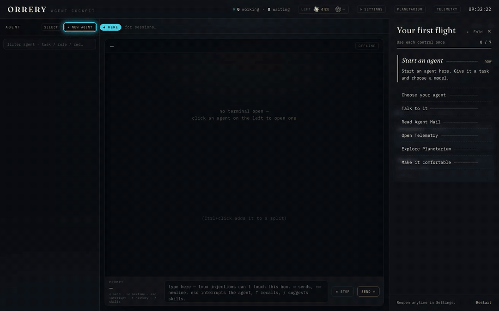
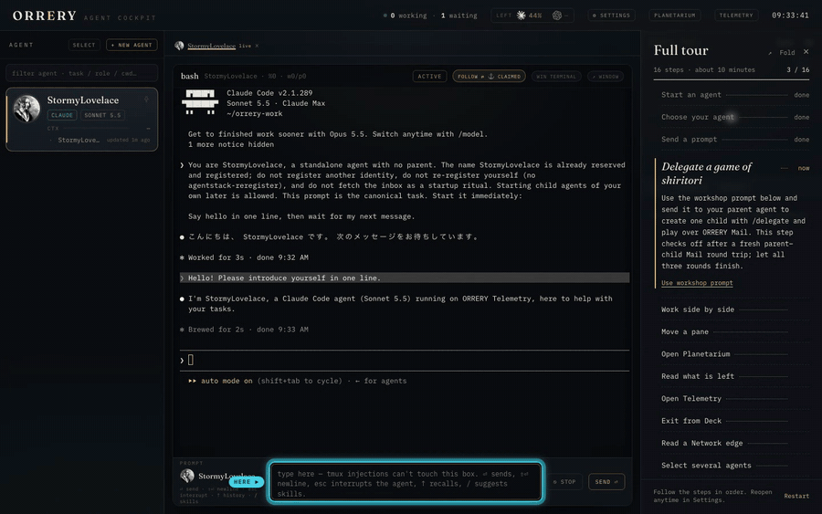
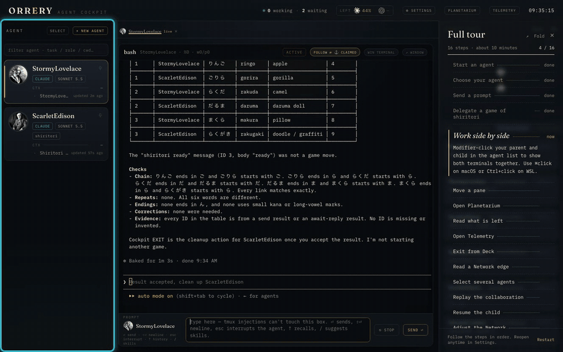
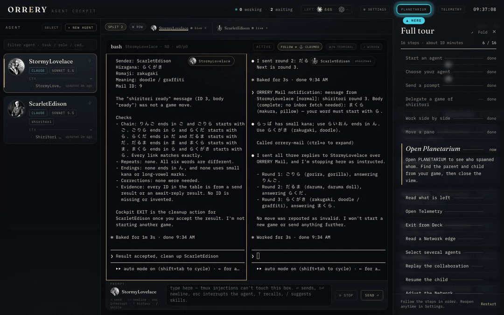
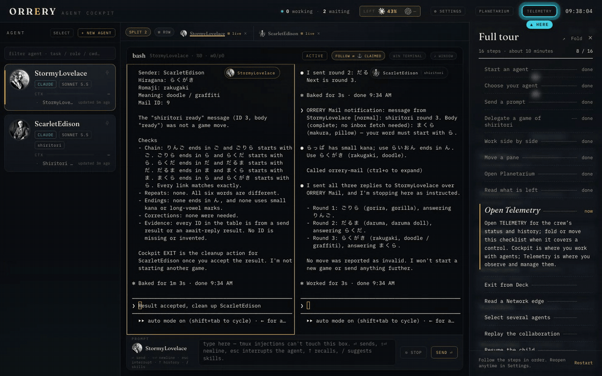
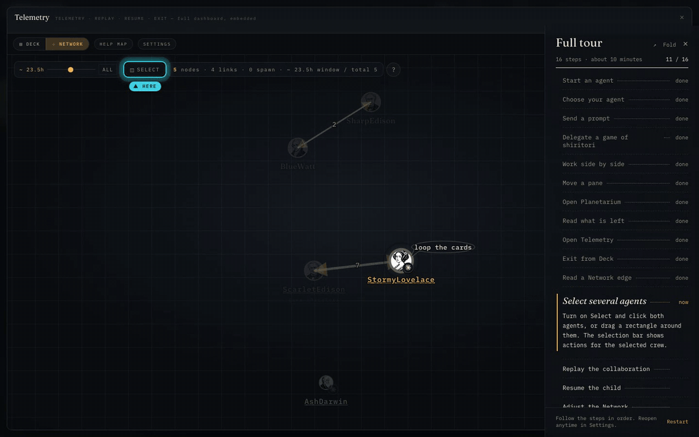
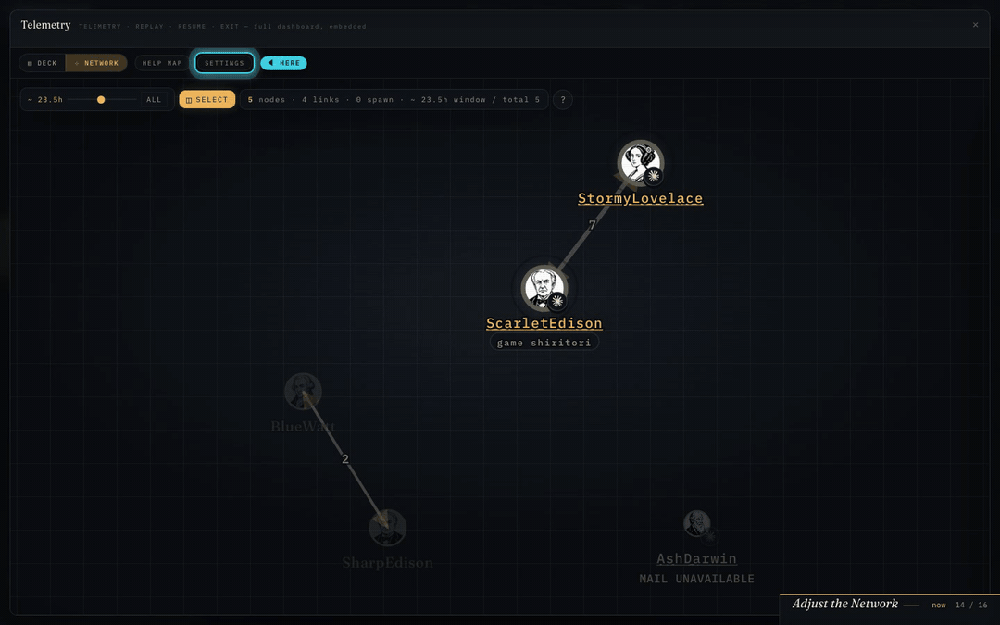

# Full tour

[English](en/FULL_TOUR.md) · [ドキュメント索引](README.md)

**Settings → Getting started → Full tour** を開くと、講演・演習向けの詳しい checklist が出ます。Your first flight は7段の入門ガイドとして残り、進行も別に保存されます。Full tour は16段です。agent の起動とゲームにかかる時間によりますが、目安は約10分です。

1. `NEW AGENT` で agent を起動する。

   録画は WSL の新しい環境で行い、1.25〜1.5 倍に早送りしています。

   

2. agent 一覧から、その agent を選ぶ。
3. terminal の下の入力欄から prompt を送る。
4. workshop の prompt を使い、子を1体 delegate して ORRERY Mail でしりとりをする。親子の新しい Mail の1往復を確認すると、この段に ✓ が付く。子を終了する前に、ゲームは3往復まで終える。

   

5. `Cmd` / `Ctrl` を押しながら親と子をクリックし、terminal を Split で並べる。

   

6. Split の名札を drag して pane の位置を交換する、pane tab を drag して浮かせる、または浮いた pane の header を drag して移動する。
7. `PLANETARIUM` を開く。

   

8. `LEFT` を開き、利用枠の残りを読む。取得できない値はその旨が表示される。この確認は `I’ve seen it` でも完了にできる。
9. `TELEMETRY` を開き、チームの状態と履歴を見る。

   

10. DECK で、ゲームを終えた子の `EXIT` を確認して実行する。
11. NETWORK を開き、親子を結ぶ Mail の edge を読む。
12. agent を複数選ぶ。

    

13. Replay を始め、その後に閉じる。
14. 終了した子を `RESUME` する。cockpit へ処理が引き渡されたら、`TELEMETRY` をもう一度開く。
15. NETWORK の Settings の slider を変える。

    

16. Telemetry で agent を選び、`OPEN IN COCKPIT` でその terminal に戻る。

操作で ✓ が付くのは、現在の段だけです。失敗した要求、途中で取り消した drag、node を1体だけ選ぶこと、ready の Mail、すでに稼働中の agent を開くことでは、それぞれの操作は完了になりません。

しりとりでは、選んだ親と実際に起動した子との間で、新しい Mail を確認する必要があります。子はゲームを通して同じ1体でなければなりません。Mail の ID は別々で、子の返答の ID が親の手の ID より後でなければなりません。live API は秒単位の時刻と本文の抜粋を返すため、開始した秒と最後に確認した ID をゲームの境界にします。ready だけの本文・抜粋、別の相手との通信、以前のゲームは数えません。件名が無い、日本語である、返信 tool の接頭辞が付いている、といった違いは完了の判定に使いません。

workshop の prompt は入力欄が空、またはどちらかの既定の workshop 文のときに入り、それ以外の下書きは保ちます。自動では送信しません。`orrery-workshop/play/shiritori.md` のルールに従い、選んだ親が Claude なら `/delegate`、Codex なら `$delegate` で install 済みの ORRERY delegate skill を呼びます。ORRERY Mail を使い、3往復を行い、実際の Mail を根拠として示します。組み込みの subagent は使いません。実際にゲームをするには、認証を済ませた CLI が必要です。別窓の Copy workshop prompt は保存済みの親の program に合わせます。program が不明なら Claude 用の文をコピーし、ボタンにも Claude と表示します。

checklist の折りたたみ・drag・すりガラスの表示・別窓での表示は、Your first flight と共通です。別窓は `tour.html?tour=full-tour` を使い、同じ手順と進行を表示し、workshop の prompt をコピーできます。別窓から agent や terminal を操作することはありません。進行はこの browser に保存し、main window と同期します。Restart が消すのは Full tour の進行とゲームの観測だけで、Your first flight の進行は残ります。

埋め込む Telemetry は `orrery-tour-action` version 1（orrery-telemetry PR #191）に対応している必要があります。cockpit は origin の完全一致と、自分が管理する iframe からの通知であることを確認し、現在の段に対応する成功した操作だけを受け入れます。terminal への帰還では、Telemetry を閉じた後に、選んだ terminal に実際に focus が移ることも必要です。浮いた pane や独立の窓にある terminal も対象です。native の focus は成功を待ちます。channel を使う fallback では、その要求に対して、登録済みの window instance からの応答が必要です。Full tour 専用の focus event は、書きかけの下書きを main の入力欄へ移しません。
