# Usage

> Japanese is the source of truth: [日本語版](../usage.md)

[Previous: Configuration](configuration.md) · [Back to README](../../README.en.md) · [Next: Troubleshooting](troubleshooting.md)

ORRERY cockpit puts the roster on the left, the terminal in the center, the ORRERY Mail rail and the lineage view on the right, and the TELEMETRY of ORRERY Telemetry into one screen.

## Find what you want to do

| What you want to do | How | Details |
| --- | --- | --- |
| Find a running agent | Search the left roster and click a tile | [Roster](#roster) |
| Paste an agent's name into a Mail recipient or an instruction | The copy icon to the right of the name on a roster tile | [Copy a name](#copy-a-name) |
| Keep a frequently watched agent at the top of the roster | The pin icon at the top right of a roster tile | [Pin](#pin) |
| Open an agent's terminal and give instructions | Open the session from the roster or the palette, then send from the composer | [Terminal](#terminal) · [Prompt composer](#prompt-composer) |
| Watch several agents at once | Hold `Cmd` / `Ctrl` and click a roster tile / session label / pane tab | [Split](#split) |
| Take one terminal out of the cockpit and view it in another window | Drag a session label over the terminal to float it. Drag it out of the cockpit (or to its edge) to make it a standalone window. The `↗ WINDOW` in the pane header also opens it | [Standalone window](#standalone-window) |
| Open a URL or path an agent printed / hand a local file to an agent | Click a URL or path in the terminal / paste a file copied in Finder into the composer | [Open from and hand to the terminal](#open-from-and-hand-to-the-terminal) |
| Use a light color scheme | Settings › Color theme, `Light` (or `System`) | [Color theme (light mode)](#color-theme-light-mode) |
| See how much of the Claude / Codex quota is left | Look at the `LEFT` pill in the header. Click it for the remaining amount per window | [Usage (remaining quota)](#usage-remaining-quota) |
| Go back to the end of the terminal from past output | `↓ BOTTOM`, `Cmd+↓`, or click the active session label / pane tab again | [Terminal](#terminal) |
| Start a new agent | `+ NEW AGENT`, then choose the engine, directory, and task | [NEW AGENT](#new-agent) |
| Read the conversation between agents | Open a card in the right mail rail. To follow two agents, click an edge in the TELEMETRY NETWORK | [Agent Mail](#agent-mail) · [TELEMETRY](#telemetry) |
| See the spawn parent–child relationships and recent traffic | Look at the mini-orrery. Open the Planetarium with `PLANETARIUM` in the header or `⤢` | [Mini-orrery](#mini-orrery) · [Planetarium](#planetarium) |
| Open the terminal of an agent you found in TELEMETRY | Select the agent in TELEMETRY and press `OPEN IN COCKPIT` | [Open in cockpit from TELEMETRY](#open-in-cockpit-from-telemetry) |
| Use it on Windows (WSL2) | Shortcuts use `Alt`; windows open in Windows Terminal | [Differences on Windows (WSL2)](#differences-on-windows-wsl2) |
| Bring back an agent that has ended | Select a gone / retired agent in TELEMETRY and press `RESUME` | [TELEMETRY](#telemetry) |
| End several agents at once | `Select` in the native roster, or `SELECT` in TELEMETRY, then `EXIT` | [Select and bulk EXIT](#select-and-bulk-exit) |
| Replay the history of several agents in time order | Select multiple targets in TELEMETRY and press `DIGEST REPLAY` | [REPLAY](#replay) |
| Switch sessions quickly | Search with `Cmd+K`, or `Cmd+1`–`Cmd+9` (on WSL, `Alt+K` and `Alt+1`–`Alt+9`) | [Jump palette and shortcuts](#jump-palette-and-shortcuts) |
| Make a URL that opens a specific session directly | `cockpit.html?session=<session-name>` | [Jump palette and shortcuts](#jump-palette-and-shortcuts) |
| Also open a terminal in Ghostty | `GHOSTTY` on the active session (`WIN TERMINAL` on WSL) | [Open in Ghostty](#open-in-ghostty) · [Differences on Windows (WSL2)](#differences-on-windows-wsl2) |
| Match the tmux display width to ORRERY / hand it back to an external client | Toggle `CLAIMED` / `FOLLOW` | [Claim / Follow](#claim--follow) |
| Show / hide ORRERY.app from the keyboard | Use the global hotkey registered at install time | [global hotkey in the install guide](install.md#global-hotkey) |

## Hard-to-find operations

The following are available in the implementation, but have no permanent on-screen explanation, only a short hint, only become apparent on hover, or live inside the embedded TELEMETRY. This table serves as the discoverability checklist when adding features. Features that can be reached with an always-visible, explicit button alone, such as Settings and `+ NEW AGENT`, are excluded.

| Hard-to-find operation | Clue on screen | Explained in this document |
| --- | --- | --- |
| The `Cmd+K` agent / tmux session palette (`Alt+K` on WSL) | No shortcut is shown until the palette is open | [Jump palette and shortcuts](#jump-palette-and-shortcuts) |
| Switch between attached sessions with `Cmd+1`–`Cmd+9` (`Alt+1`–`Alt+9` on WSL) | Not shown permanently | [Jump palette and shortcuts](#jump-palette-and-shortcuts) |
| Copy an agent name with the copy icon on a roster tile | The icon appears only on hover | [Copy a name](#copy-a-name) |
| Pin an agent to the top with the pin icon on a roster tile | Before pinning, the icon appears only on hover | [Pin](#pin) |
| A detail card (pane title, latest mail, runtime, and so on) on roster tile hover / keyboard focus | Not shown until you hover | [Roster](#roster) |
| The `N need you` chip in the header narrows the roster to only the agents waiting on a question or approval | The chip appears only when such agents exist | [Roster](#roster) |
| Leave the roster's Select mode with `Esc` | Not shown permanently | [Select and bulk EXIT](#select-and-bulk-exit) |
| Add to / remove from Split with `Cmd` / `Ctrl` + roster tile, session label, or pane tab | Only a small hint when no terminal is selected | [Split](#split) |
| After moving to single view, restore the previous Split with the `SPLIT n` chip | Only the chip's tooltip | [Split](#split) |
| Drag a Split identity label to another cell to swap the order | No drag handle is shown | [Split](#split) |
| Drag a session label to float it; move the floating window's title bar out of the cockpit (or to its edge) to make it a standalone window | No drag handle is shown. The only thing visible is `↗ WINDOW` in the pane header | [Standalone window](#standalone-window) |
| Choose the Split layout with the `⊞` chip in the tab strip | The chip text is only the current layout name | [Split](#split) |
| Drag a Split divider; double-click a grid divider to reset the ratio | Only a hover line and a tooltip | [Split](#split) |
| Click the active session label / pane tab / Split identity label again to jump to the end | No explanation on the label | [Terminal](#terminal) |
| `Cmd+↓` jumps to the end of the active terminal (Mac only) | Not shown permanently. `↓ BOTTOM` appears while scrolled up | [Terminal](#terminal) |
| The `×` on a session group detaches without killing tmux; the `×` on a pane tab is a close request for a managed pane | The same `×` means different things | [Terminal](#terminal) · [Split](#split) |
| Composer `Esc` interrupt, `↑` / `↓` history, skill suggestions with `/` or `$`, image paste | Only a short hint above the composer | [Prompt composer](#prompt-composer) |
| The send guard that stops built-ins that end a session, and mixed-up symbols, before sending | Appears only when you send such input | [Send guard](#send-guard) |
| Click a URL in the terminal to open a browser; click a path to open Finder / Explorer | Only an underline appears when the mouse is over it | [Open from and hand to the terminal](#open-from-and-hand-to-the-terminal) |
| Pasting a file copied in Finder into the composer inserts its absolute path (there is no drag & drop) | Only a toast after pasting | [Open from and hand to the terminal](#open-from-and-hand-to-the-terminal) |
| Click the `LEFT` pill for the remaining amount and reset per window, and the reason when it cannot be read | The pill shows only the smallest % | [Usage (remaining quota)](#usage-remaining-quota) |
| Color theme (Dark / Light / System) and Vision profile in Settings | Not visible until you open Settings | [Color theme (light mode)](#color-theme-light-mode) |
| The `×` on a Split cell's name tag removes only that session | Appears only when the mouse is over the name tag | [Split](#split) |
| An unsent draft in a standalone window returns to the cockpit when the window is closed | Nothing is shown when it returns | [Standalone window](#standalone-window) |
| The roster search count `N/M`, and `Clear` when there are 0 matches | Appears only while searching | [Roster](#roster) |
| The `?session=` deep link and the development-only `?ws=` override | No UI entry point | [Jump palette and shortcuts](#jump-palette-and-shortcuts) |
| Hover a mini-orrery node for identity / role / model; click for the mail filter and terminal jump | Nodes have no text label | [Mini-orrery](#mini-orrery) |
| `⤢` on the mini-orrery opens the Planetarium; close with `Esc` or a click outside | The glyph has no text label | [Planetarium](#planetarium) |
| Click a mail card for the body, `thread` for the thread, `Esc` to close the drawer | No details until you open a card / the drawer | [Agent Mail](#agent-mail) |
| The mail rail filter follows the focus of a roster tile / mini-orrery node / terminal | Only the selected filter chip changes | [Agent Mail](#agent-mail) |
| After choosing a scientist in NEW AGENT, re-roll an unused adjective with 🎲 | Only the icon and a tooltip | [NEW AGENT](#new-agent) |
| Click an edge in the TELEMETRY NETWORK for a mail drawer between two agents | Not visible from the ORRERY-side buttons | [TELEMETRY](#telemetry) |
| `OPEN IN COCKPIT` in TELEMETRY's agent panel moves to that agent's terminal | Not visible until you open TELEMETRY and select an agent | [Open in cockpit from TELEMETRY](#open-in-cockpit-from-telemetry) |
| Select a gone / retired agent in TELEMETRY and `RESUME` | Ended agents do not appear in the native roster | [TELEMETRY](#telemetry) |
| Bulk `EXIT` / `RESUME` / `DIGEST REPLAY` from a TELEMETRY multi-selection | Not visible until you open TELEMETRY | [TELEMETRY](#telemetry) · [REPLAY](#replay) |
| On a spawn name collision in TELEMETRY, `SHUFFLE` proposes another name for the same scientist | Shown only inside the embedded spawn modal | [NEW AGENT](#new-agent) |
| The global show / hide hotkey of ORRERY.app, and the priority order of its candidates | The cockpit does not show the current assignment | [global hotkey in the install guide](install.md#global-hotkey) |

## Checks after launch

1. Check that the header does not show `connecting` / `disconnected` / `error` (nothing is shown while live)
2. Check whether the ORRERY Telemetry dashboard is reachable with `/telemetry/health`
3. Check that the agent names in the roster match the session names in `tmux list-sessions`
4. Open one terminal and check input and output

Even if ORRERY Telemetry is unreachable, terminals remain usable. The roster shows `dashboard offline`, spawn returns an error, and the TELEMETRY embed stops.

## Roster

The roster fetches ORRERY Telemetry `/api/agents` every 3 seconds and shows running agents.

How to read a tile (from the top):

- The scientist portrait and name (on hover, a copy icon appears to the right of the name and a pin icon at the top right)
- The engine (`claude` / `codex` / `gemini`, etc.), `model · context window`, and role. When there is no role, the tail of the cwd that distinguishes it from other agents is shown
- The `CTX` bar and %: the agent's **context usage**. The color changes above 65%
- A state symbol and description: `◇` working, `⏎` waiting for approval, `?` waiting for an answer, `·` idle. The description is the task if it is specific, otherwise the pane title, otherwise `Needs description`. When the task changes, `updated Nm ago` is added

The order is: pinned agents → waiting for approval / an answer → working → idle → most recently active → name. Clicking a tile attaches the tmux session with the same name as the agent if needed and focuses it (`Tab` to focus and `Enter` / `Space` do the same).

The search box filters by name, description (task or pane title), and role (or the cwd difference when there is none). The model and provider are not searched. While filtering, the count is shown as `N/M`, and when nothing matches, a `searched: task, role, cwd · Clear` bar appears.

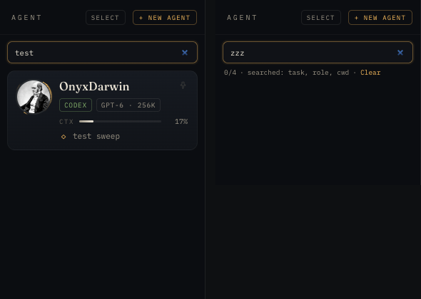

Rows in warmup, finished, gone, and retired states are not shown in the left roster. Agents from the Codex App Bridge appear in telemetry but have no tmux pane, so the terminal jump becomes an offline hint.

Clicking a tile also switches the right mail rail's filter to that agent. Hovering over a tile (or focusing it with `Tab`) shows a detail card on the right. It lists the pane title, the subject of the latest mail, the last active time, the time it was registered with ORRERY Mail, the start time, provider / model / command, the number of deliverables (Deliverables; shown only when there is at least one), and the source and specificity of the description being shown.

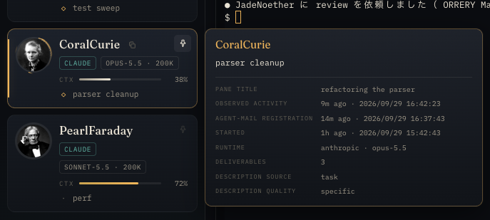

Deliverables are that agent's work logs (`LOG_*.md` files whose frontmatter `agent:` is that agent) that ORRERY Telemetry collects from the project's `logs/`. The list can be opened in the `Output` tab of the TELEMETRY agent panel ([TELEMETRY](#telemetry)).

`working` / `waiting` in the header are the numbers of running agents.

### Agents that need a human decision

An agent whose work has stopped while it waits for an answer to a question (`?`) or for approval (`⏎`) is made to stand out as follows.

- The ring around its portrait in the roster lights up. An approval wait blinks red, and a question wait pulses slowly in light blue (if your OS is set to reduce motion, the question-wait pulse stops)
- Its tile is placed near the top of the roster (right after pinned agents)
- `N need you` appears in the header. Click it to narrow the roster to just those agents, and click again to clear it (it clears automatically when no agent is waiting)
- A `?` (question wait) or `!` (approval wait) is attached to the upper right of the node in the mini-orrery and the Planetarium

Click the tile to enter its terminal, read the question, and send your answer from the composer. Once you answer and the agent starts moving again, the blinking and `need you` disappear.


How this looks in the TELEMETRY DECK and NETWORK is described in [Spotting agents that need you](#spotting-agents-that-need-you).


### Copy a name

Hovering over a tile shows a copy icon to the right of the agent name. Clicking it puts only the agent name (without emoji or role, the exact name that Mail and spawn use) on the clipboard, and `COPIED · <name>` appears at the bottom right. You can paste it directly into a Mail recipient or an instruction to another agent.

In a window where the clipboard cannot be used, or when the browser does not allow writing, `COPY FAILED · …` is shown. It is also shown as a failure when there is no response after 3 seconds. The icon is not shown during Select mode.

### Pin

With many agents running, the roster keeps reordering by state. If you pin the agents you always look at, such as a parent agent or a reviewer, they stay at the top regardless of reordering.

Pressing the pin icon at the top right of a tile pins that agent to the top of the roster. A divider separates the pinned agents from the rest. Press it again to unpin (`PINNED` / `UNPINNED` is shown).


Pin is a feature of the left roster only. The right mail rail and the mini-orrery have no pin. The pin state is shared between ORRERY.app and browser tabs, like Settings, and is removed automatically when the agent retires. The icon is not shown during Select mode.

## Usage (remaining quota)

The `LEFT  CLAUDE 41%  CODEX 47%` pill to the left of Settings in the header shows **how much of the account-level quota is left**. It is different from each agent's `CTX` (the context usage of that session). For each provider, the pill shows the **% of the window with the least remaining** among the regular quotas (the one that actually constrains your next work).

Clicking the pill opens `Usage left`, which lays out the windows returned by the provider as arc dials, each with the time until reset.

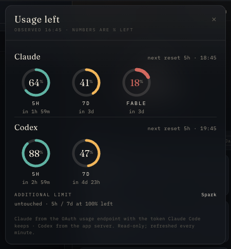

- **Claude**: `5h` (the 5-hour quota), `7d` (the weekly quota), and per-model weekly quotas (such as `FABLE`; only when the server returns them)
- **Codex**: `5h` and `7d`. Named additional quotas such as Spark are shown separately under `ADDITIONAL LIMIT` and are not used for the pill's value. When an additional quota has not been used at all, it is collapsed into one line: `untouched · 5h / 7d at 100% left`
- Number and ring colors: green above 50%, yellow at 50% or below, red at 20% or below
- Under each dial is the time until reset (`in 2h 59m`, `in 3d`). To the right of the heading is the time of the earliest reset


**Source and update interval**: the cockpit does not read providers directly. It receives the values that the ORRERY Telemetry dashboard has read (`/api/quotas`) through the ORRERY backend.

- Claude: reads Anthropic's usage endpoint with the OAuth token that Claude Code holds (the token is only read; it is never refreshed or written back)
- Codex: `account/rateLimits/read` of `codex app-server`
- The cockpit re-reads every minute (while the tab is visible), when the pill is opened, and when you return to the tab. The ORRERY backend caches the same values for 60 seconds. ORRERY Telemetry decides how often the provider is queried (about once every 10 minutes for Claude)

**When stale or unavailable**: while fetching fails, the previous values are kept, the pill's numbers are dimmed, and `· stale` is added to the `Usage left` heading. The reason it cannot be read is shown to the right of the heading.

| Display | Meaning |
| --- | --- |
| `sign in to Claude Code` | The Claude Code token is missing or has expired |
| `codex not on PATH` | `codex` cannot be found |
| `not reachable` | The provider cannot be reached |
| `rate limited · retrying later` | The provider rate-limited the request. It will be retried later |
| `unavailable` | ORRERY Telemetry is stopped, or is not returning a value for that provider |

Standalone windows ([Standalone window](#standalone-window)) do not fetch the remaining quota.

## Select and bulk EXIT

In Select mode you choose multiple eligible live agents, and ORRERY sends requests to ORRERY Telemetry's `/api/exit` one after another.

1. Open Select mode
2. Choose the target agents
3. Press EXIT
4. Press the second confirmation within 3 seconds

`Esc` leaves Select mode.

This is a state-changing operation that asks the agent processes to exit. Unlike reading mail or applying a UI filter, re-check the targets before running it. It is unavailable when the ORRERY Telemetry dashboard is unreachable.

## Terminal

The terminal uses `xterm.js` and operates panes through the ORRERY backend's `/ws` and tmux control mode.

- Session groups and pane tabs
- Keyboard input
- A 6000-line scrollback on the browser side
- Jump to the end with `↓BOTTOM` or `Cmd+↓`
- Automatic reconnection 1.5 seconds after the backend disconnects
- A URL in a pane opens in the default browser on click; an absolute path such as `/…` or `~/…` opens in Finder on click (a file is shown selected, a folder is opened). Paths with spaces are also recognized automatically up to the part that exists. A single word such as `/compact` or a relative path does not become a link

Clicking the active session label / pane tab again also jumps to the end. `Cmd+↓` is Mac only. On WSL, use `↓ BOTTOM` or a click on the label again. The `×` on a session group only detaches it from the cockpit and does not kill the tmux session. The `×` on a pane tab asks the backend to close the pane, but destructive closes are limited to managed sessions with the `orrery-` prefix, and the last pane is never closed.

At startup, the backend connects one recorder connection for each live tmux session. Pane attach from the browser is deferred until you act on a tile / the palette.

While you are scrolled up reading past output, new output does not pull you back to the end. When the backend restarts, the cockpit reloads the page automatically (the composer draft is kept).

## Open from and hand to the terminal

URLs and file paths that an agent printed in the terminal can be opened with a click. Conversely, you can hand a local file to an agent just by pasting it.


- **Click a URL**: opens in the default browser (`https://` and `http://` only)
- **Click a path**: an absolute path such as `/…` or `~/…` is shown in Finder (Explorer on Windows). A file is shown selected, and a folder is opened. Paths with spaces are also made links automatically up to the part that exists. A single word such as `/compact` or a relative path does not become a link
- **Paste a file**: copy a file in Finder (`Cmd+C`) and press `Cmd+V` in the composer, and the file's **absolute path** is inserted at the cursor. Multiple files are separated by spaces, and paths containing spaces or quotes are wrapped in `'…'`. `path → composer` (or `N paths → composer` for several) is shown. Add "read this file" and send, and the agent receives the file
- **Paste an image**: when you paste image data that is not a file, such as a screenshot, the cockpit sends `Ctrl+V` to the agent's terminal instead of the composer, and the CLI itself reads the image (`image → <agent>` is shown). On WSL, the image is saved as a PNG and its path is inserted into the composer

You **cannot drag & drop** files or images into the cockpit. Use pasting.

On Windows (WSL2), URLs open in the Windows default browser and paths open in Explorer. Both work when the backend was started from the desktop, such as from Windows Terminal (no window appears for a backend started over ssh). Pasting files and images also works. For how it works on WSL (a file copied in File Explorer is converted to a WSL path and inserted; a screenshot is saved as a PNG and its path is inserted), see [Pasting files and images on WSL](#pasting-files-and-images-on-wsl).

## Split

Holding `Cmd` or `Ctrl` while choosing agents / sessions lets you show up to 12 sessions at the same time.

- Layout presets depending on 2–4 items or 5 or more
- row / column / wide / main-left / grid
- Resize by dragging a divider
- Reorder by dragging a label


Hovering over a cell's name tag shows `×`. Pressing it removes that session from the cockpit (the tmux session remains), and when only one is left, the view returns to single view. Dragging a name tag can be canceled with `Esc`.

Even if you temporarily leave the Split and show a single session, the member list remains in the `SPLIT n` chip, and pressing the chip restores it. The identity label at the top of a Split cell is focused by a click, and dragging it to another cell swaps the two positions. Divider ratios can be changed by dragging, and a divider in a grid layout is reset to equal ratios by a double-click.

Pressing the `⊞` chip to the right of `SPLIT n` in the tab strip (which shows the current layout name) opens the list of layouts available for that number of sessions. For 2 items they are ROW / COLUMN; for 3, WIDE / MAIN-L / ROW / COLUMN; for 4 or more, GRID / ROW / COLUMN. The chosen layout is remembered for each number of sessions. The tab of a session that is in the Split gets a `⊞` mark.

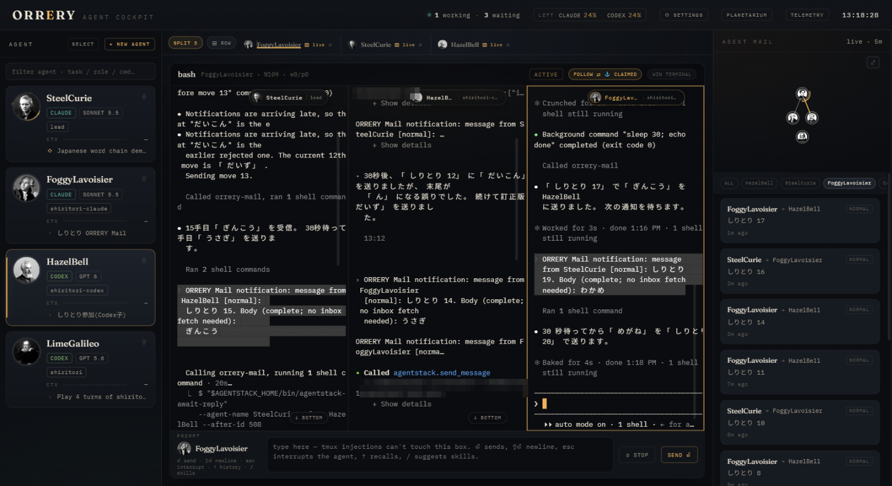


This Split is a display feature that lines up multiple sessions. Unlike tmux's `split-window`, it does not create new panes in ordinary agent sessions.

The destructive `split` / `close` of the WebSocket protocol itself is allowed only for managed sessions with the `orrery-` prefix. `close` does not remove the last pane.

## Standalone window

You can take one session's terminal out of the cockpit, floating it or opening it in another window.

- **Float**: grab a session label in the tab strip and release it over the terminal. It floats over the cockpit as a small window with a title bar. Move it by the title bar and resize it with the bottom-right corner
- **Make it a standalone window**: drag the session label out of the cockpit and release it. For a floating window, move its title bar out. When the window is maximized and there is no outside, release it at the edge, 8px in (the ghost shows `OWN WINDOW`). You can also open it by pressing `↗ WINDOW` in the header of the active pane
- **Bring it back**: when you close the window, the session returns to its original cockpit tab and comes to the front. You can also bring it back with `⇤` on a floating window, `⇤ COCKPIT` in the header of a standalone window, or `⇤` on the chip in the tab strip


A session that is outside stays in the tab strip as a `◰ FLOAT` / `↗ WINDOW` chip. Clicking the chip brings that window to the front. When you choose that agent from the roster or the palette, the cockpit does not open it a second time; it brings the window to the front. A session that was in a Split leaves the Split when taken out. When it returns, it comes back as an ordinary tab.


The content of a standalone window is the same cockpit page opened in a single-session view (`cockpit.html?solo=1&session=<name>`). From the backend's point of view, it is just one more websocket on the same session. The connection to tmux (the recorder) does not increase. While a session is outside, the cockpit detaches that session, so the same session is never drawn at two widths at the same time. Claim / Follow works at the size of the window that went outside.

How the window opens depends on the environment.

- ORRERY.app: opens as an app window
- Browser (a Mac browser, or the Windows-side browser for WSL): opens as a popup. When the popup is blocked, a toast appears and the session stays as a floating window. Allow popups for the cockpit's origin (such as `127.0.0.1:8791`)

Even if you reload the cockpit, the open windows are picked up automatically and the chips come back.

If you close a window while it has a draft in its composer, that draft returns to the cockpit's composer (when the cockpit side already has a different draft, it is not overwritten; `UNSENT TEXT … KEPT` is shown and the window's draft is kept).

## Claim / Follow

For a session with no interactive terminal client, ORRERY claims the viewport size and adjusts the tmux window. When another interactive client such as Ghostty appears, ORRERY normally releases the claim and follows that client.

- Claim changes tmux's actual grid size
- It also affects the wrap width of external clients
- A manual toggle takes priority over automatic detection
- Just before the first Claim of each window, it takes a snapshot of whether the local `window-size` option exists, its value, and the exact grid size
- Claiming the same window again does not overwrite the first snapshot
- Follow sends a release to every distinct window in the session that ORRERY owns, and restores each snapshot
- Group close / auto detach / app close release the owned windows before detaching
- The backend also restores only the tracked windows on the last peer detach / disconnect / teardown

On restore, the grid size and local option from before the Claim are put back as they were. If the original was unset, it returns to unset, and a value such as `manual` that an external client set returns to its original value. A window that was only attached / detached without a Claim gets no size command and its external manual setting is not changed.

While sharing your screen or operating an existing TUI, be aware of the width change caused by Claim. A tracked entry that failed to restore is not consumed and is retried on a later release / detach / teardown. If it still cannot be restored at teardown, the backend records the session name and window ID to stderr.

## Open in Ghostty

You can open the active session in an external Ghostty. The implementation uses the following executable.

```text
/Applications/Ghostty.app/Contents/MacOS/ghostty
```

If an interactive client is already attached, no new window is opened and it is treated as `already`. There is no public override for the Ghostty path.

## Prompt composer

The composer is an input box separate from the terminal. If you type directly into the terminal, notifications from other agents flow into the same terminal and bury what you are writing; text you type in the composer stays as it is no matter what flows into the terminal.

The destination is the agent of the pane that is active at that moment (its face and name appear to the left of the composer). If you click a roster tile or a tab to make another agent active, only the destination switches, and the text you are typing carries over as it is.


There is only one draft in the cockpit, and it is not split per destination agent. It is saved every time you type, survives a reload or a restart of ORRERY.app, and disappears when you send. It is stored in that window's `localStorage` and is not shared with other windows. Each standalone window has its own draft per session (it returns to the cockpit when closed; see [Standalone window](#standalone-window)).

The composer sends a bracketed paste to the active pane, then sends a carriage return 250 ms later.

| Action | Behavior |
| --- | --- |
| `Enter` | Send |
| `Shift+Enter` | New line |
| `Esc` | Interrupt |
| `↑` / `↓` | Send history of up to 50 entries |
| File paste | Put the path of the copied file into the composer (a path containing spaces is wrapped in quotes) |
| Image paste | Mac: forward a literal `Ctrl+V` to the TUI. WSL: save the image as a PNG and put its path into the composer |

There is a guard that prevents accidental sending on Enter during IME composition. The send history is also stored in `localStorage`.

`⎋ STOP` is the same interrupt as `Esc`, and `SEND ⏎` is the same send as `Enter`. When you send, `sent → <agent>` is shown. The face and name of the destination agent appear to the left of the composer. Pasting a file inserts its path ([Open from and hand to the terminal](#open-from-and-hand-to-the-terminal)).

### Skill and command suggestions

When the input starts with `/` or `$`, up to 8 skills and built-in commands of the destination CLI are offered as suggestions. Choose with `↑` / `↓` and confirm with `Tab` or `Enter`, and it is inserted with that CLI's correct symbol (`/` for Claude and Gemini, `$` for Codex).

| Destination | Where skills are looked up | Built-ins |
| --- | --- | --- |
| Claude Code | `~/.claude/skills` | compact / clear / model / mcp / resume / help |
| Codex | `~/.codex/skills` (including bundled skills) | compact / new / model / approvals / status / help |
| Gemini | `~/.gemini/skills` | compress / clear / model / mcp / stats / help |

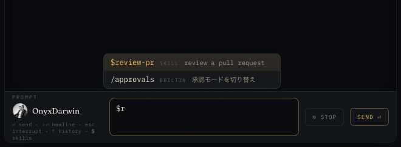

### Send guard

Before sending, if the first line is one of the following, it is not sent, and a confirmation bar appears above the composer.

- **A built-in that ends or deletes the session**: Claude's `/clear` `/logout` `/exit` `/quit`, Codex's `/logout` `/quit` `/exit` `/new`, Gemini's `/clear` `/exit` `/quit`
- **A mixed-up symbol**: when you try to send `/name` to Codex or `$name` to Claude. If a skill with the same name exists, a button to correct the symbol and send is shown

The buttons on the bar are: correct and send (for example `send as $review-pr`), `send as typed` (send it as is), and `cancel`.

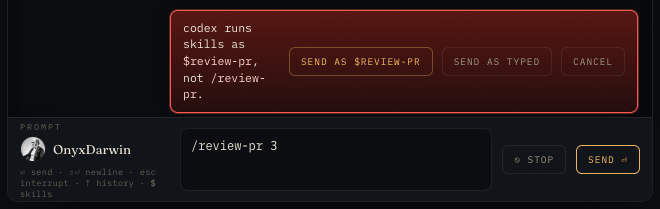

## Jump palette and shortcuts

`Cmd+K` opens a fuzzy search palette. The targets are roster agents and tmux-only sessions.

- `↑` / `↓`: select
- `Enter`: focus / attach
- `Esc`: close
- `Cmd+1`–`Cmd+9`: focus an attached session

When there are split members, their order takes priority for the number shortcuts.

You can specify a session from the URL.

```text
http://127.0.0.1:8791/cockpit.html?session=<session-name>
```

Only during development, `?ws=ws://127.0.0.1:<port>/ws` can override the WebSocket.

## NEW AGENT

`+ NEW AGENT` uses the spawn API of the ORRERY Telemetry dashboard. When the dashboard is offline, part of the catalog may be shown but spawn cannot be run.

Input fields:

- Identity: Auto, or Scientist + Adjective
- Claude / Codex provider, model, and reasoning effort
- Working directory
- Task (required, up to 4000 characters)
- Standalone or parent
- Role / emoji / group
- Worktree / base revision
- Headless or Ghostty

Parent candidates are only live Claude agents. Auto sends `name:null`, and the final validation of name, model, effort, and directory is done by the ORRERY Telemetry server.

When you press `Spawn`, progress appears at the bottom right. It is `LAUNCHING · <name>`, then `SPAWNED · <name>` if it launched, or `SPAWN FAILED · <name> · <reason>` if it failed. If no result comes back after 140 seconds, `no verdict after 140s` is shown (the agent may have started, so check the roster).

When you choose a scientist, an unused adjective is chosen automatically, and you can re-roll it with 🎲 on the name card. In the spawn modal on the embedded TELEMETRY side, on a name collision, `SHUFFLE` has the server propose another verified name for the same scientist.

The filesystem browser excludes hidden directories and returns up to 200 entries. However, ORRERY's `/telemetry/fs/dirs` has no root allowlist, so keep to the localhost-only usage boundary.

## Mini-orrery

The mini-orrery shows the spawn forest of live agents and the mail edges / comets of the last 90 seconds.

- Click a node to jump to the agent / session
- Hover a node to show identity, role, and model
- Spawn edges show parent–child relationships
- Mail edges show recent traffic
- In Settings, switch between the whole Orrery and the Telemetry network centered on the active agent
- The Telemetry network depth is 1–3 hops

Color is used for lineage, and running state is expressed by motion. A `?` at the top right of a node means waiting for an answer to a question, and `!` means waiting for approval. Comets for Mail of importance high / urgent are drawn larger.

## Planetarium

Open the overlay with `PLANETARIUM` in the header, or `⤢` at the top right of the mini-orrery.

- The spawn forest
- Live mail of the last 90 seconds
- Agent jump
- `OPEN TELEMETRY`

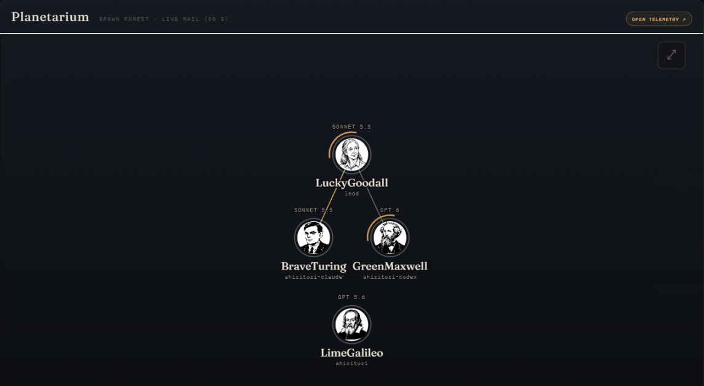


Clicking a node moves to that agent's terminal and closes the overlay. `Esc`, a click outside, or `⤢` at the top right also closes it. Even if you set the mini-orrery to the Telemetry network view in Settings, the Planetarium always draws the spawn forest. The Planetarium is a lineage exploration inside the cockpit. Its role differs from the full NETWORK / DIGEST REPLAY of the ORRERY Telemetry dashboard.

## Agent Mail

The right rail merges the live message window of ORRERY Telemetry with the recent 40 items that ORRERY fetches from the read-only SQLite, removing duplicates.

- Filter by ALL or the 8 most recent agents
- Message detail
- Safe, limited Markdown
- Thread view (up to 50 items)


Clicking a mail card switches the lower half of the rail to a drawer for that message. The drawer shows the sender, the recipients (distinguishing to / cc), the exact time and elapsed time, importance, subject, and body. A message with a thread switches to a chronological view with `thread (n)`, and clicking an item in the thread opens that message. `←` or `Esc` returns to the list.

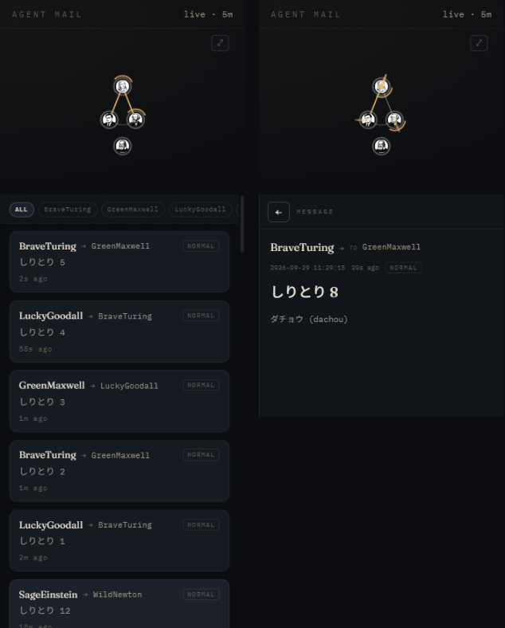

Clicking a mail card or a sender name does not move you to a terminal. To open an agent's terminal, use a tile in the left roster or a node in the mini-orrery. In the other direction they are linked: selecting a roster tile, pressing a mini-orrery node, or focusing a terminal pane switches the filter chip to that agent (for a pane, only when that agent's mail is in the list). If you select an agent that is not shown in the chips, that agent's recent mail is additionally fetched.
To the right of the right rail's heading, it normally says `live · 5m`. If it says `project key not configured` there, the project key used to read the Mail DB has not been set ([Configuration](configuration.md)).

The mail UI is display-only. There are no reply / send operations. The DB is opened in SQLite read-only mode, but other cockpit features include state-changing operations such as terminal input and spawn.

## TELEMETRY

The TELEMETRY button opens the ORRERY Telemetry dashboard as an iframe at `/network/?embed=1`. The ORRERY backend proxies the dashboard root, `/api/*`, `/assets/*`, and `/portrait` to the same origin.

Everything below is an actual screen of the ORRERY Telemetry dashboard embedded in ORRERY. It is not ORRERY's native roster / terminal / mail rail. `DECK` reads each agent's state as cards, and `NETWORK` reads the spread among agents as nodes and links.

### Initial state

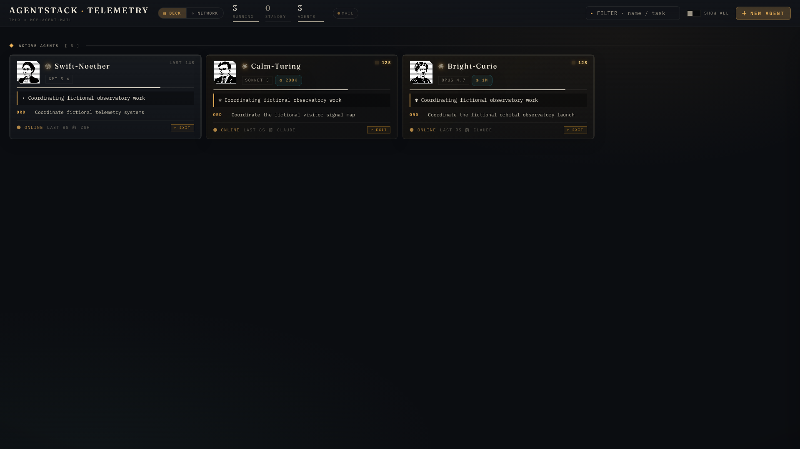

What to look at: in `DECK`, you can check `RUNNING` / `AGENTS` at the top and each card's name, model, task, and running state at a glance.

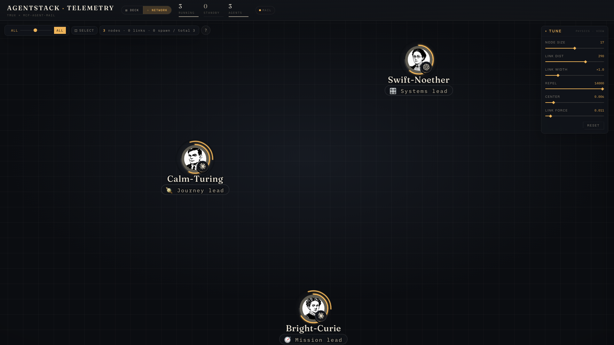

What to look at: `3 nodes · 0 links` is shown at the top left of `NETWORK`, and you can see the three agents that have no links yet as individual nodes.

### With more agents and traffic

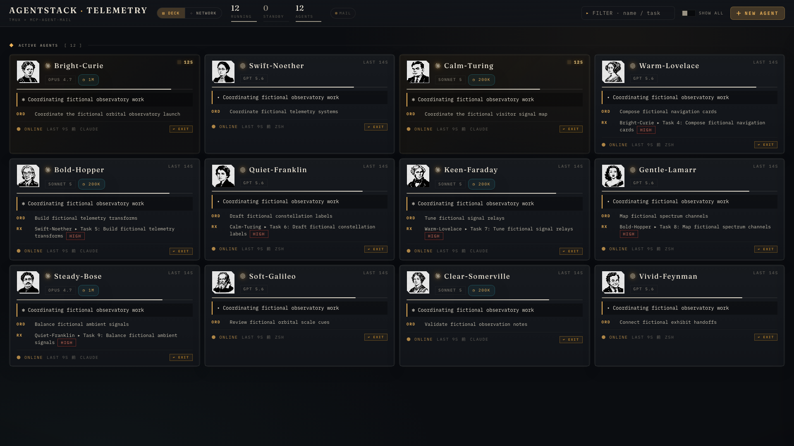

What to look at: as agents increase, the cards grow to 12, and on cards with `RX` you can also tell the counterpart, task, and importance on the same screen.

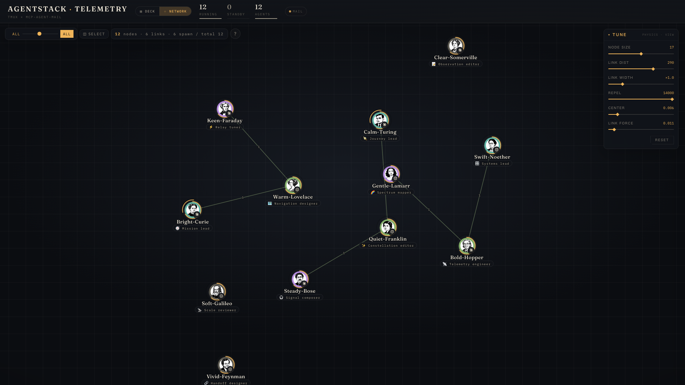

What to look at: from `12 nodes · 6 links · 6 spawn / total 12` and the lines between nodes, you can get an overview of the growth and the spread of connections.

### Spotting agents that need you


What to look at: the `?` at the top right of a card means waiting for an answer to a question, and the red outer frame and `APPROVAL` mean waiting for approval. Tell them apart from ordinary running cards and identify the agents that need a human decision first.

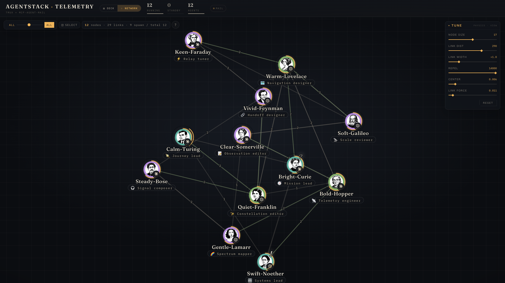

What to look at: even when traffic becomes dense, you can find agents that need you by the `?` near a node. Check the distinction between waiting for an answer and waiting for approval in the `DECK` display.

Features available on the embed side:

- NETWORK
- History / Output
- role assign
- SELECT
- EXIT / RESUME
- DIGEST REPLAY

A NETWORK node selects an agent, and an edge opens the ORRERY Mail drawer between those two. Gone / retired agents do not appear in the native roster, so to bring one back, select it in TELEMETRY and run `RESUME`. `EXIT` / `RESUME` / `DIGEST REPLAY` for multiple agents can also be run from `SELECT` in TELEMETRY.

The `History` tab of the agent panel lists that agent's conversation and tool calls in time order (including the content of file edits, `Edit`, up to the first 240 characters). The `Output` tab lists that agent's deliverables (work logs `LOG_*.md`, up to 25), and a file inside an Obsidian vault can be opened in Obsidian with a click. To check what another agent edited, use this `History` or that agent's terminal (line them up in a Split to see them at the same time).

These are not a reimplementation of the ORRERY native UI; they are features of the ORRERY Telemetry dashboard. They are unavailable when `:8770` is unreachable.

The cockpit controls the iframe's pause / resume and bridges jumps from the dashboard to the cockpit's pane focus.

### How the connection works

TELEMETRY is the ORRERY Telemetry (the repository is orrery-telemetry) dashboard itself (default `127.0.0.1:8770`). The cockpit does not rebuild the dashboard.

1. When you press `TELEMETRY` in the header, the cockpit loads `/network/?embed=1` into an iframe inside an overlay
2. The ORRERY backend (`:8791`) relays `/network/*` to the dashboard's `/`, and `/api/*`, `/assets/*`, and `/portrait` to the dashboard as they are. From the browser it is the same origin as the cockpit, so the iframe and the cockpit can talk through `postMessage`
3. A dashboard opened with `embed=1` hands the work to the cockpit instead of opening terminals itself

From the cockpit to the dashboard, it sends a stop of updates (`net-pause`) when the overlay is closed and a resume (`net-resume`) when it is reopened. It also sends the Settings color scheme to the dashboard. From the dashboard to the cockpit, it sends the following two.

| Action on the dashboard side | Cockpit behavior |
| --- | --- |
| `OPEN IN COCKPIT` in the agent panel | Closes TELEMETRY, opens and focuses that agent's terminal |
| `+ NEW AGENT` | Closes TELEMETRY and opens the cockpit's own NEW AGENT screen |

### Open in cockpit from TELEMETRY


Clicking a card in the TELEMETRY `DECK` opens that agent's panel. Pressing `OPEN IN COCKPIT` at the top right closes TELEMETRY and opens that agent's terminal in the cockpit. When the dashboard is opened by itself (`http://127.0.0.1:8770/`), the same button becomes `OPEN TMUX`, and the dashboard's server opens a terminal window.

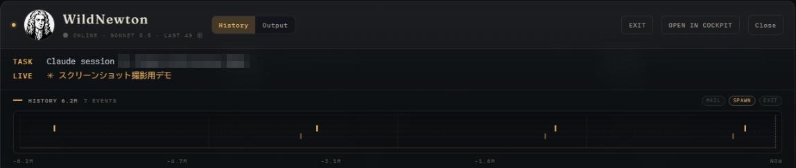

There is no button to move from a standalone dashboard to the cockpit. When you want to open a specific agent on the cockpit side, use a `cockpit.html?session=<session-name>` URL ([Jump palette and shortcuts](#jump-palette-and-shortcuts)).

## REPLAY


How to operate: press `SELECT` in TELEMETRY's `NETWORK`, click nodes to choose two or more agents, and press `Replay` in the bar that appears below. `PLAY` / `PAUSE` plays and pauses, the `SPD` scale sets the speed (×1 to ×10000), `HOLD` sets how long Mail speech bubbles stay on screen, and clicking the time axis jumps to any moment. `✕ CLOSE` or `Esc` ends it.

REPLAY is the DIGEST REPLAY of the embedded ORRERY Telemetry dashboard. Choose multiple agents that have ORRERY Mail history, and it replays mail, spawn, exit / retire, and state transitions in time order.

- play / pause / seek
- speed and HOLD
- GROUP-ONLY
- TIME-TRAVEL

It is not a feature that generates a replay with the ORRERY backend alone. ORRERY Telemetry and project-scoped mail history are required.

## Settings

The backend keeps settings in `~/.orrery/prefs.json`, shared between ORRERY.app windows and browser tabs. A change made anywhere is reflected in the other windows within a few seconds (prompt drafts and history are per window).

Values you can change in Settings:

- Terminal font: 9–16 px, in 0.5 px steps
- Auto-shrink for 5-way split and above: -1.5 px
- Mini-orrery mode
- Telemetry network depth

Values are kept in the browser's `localStorage` and synchronized with the backend's `~/.orrery/prefs.json` about every 4 seconds. Reset restores only the font and auto-shrink; it is not an operation that clears all cockpit state.

The color scheme (Dark / Light / System) and the Vision profile are also in Settings ([Color theme (light mode)](#color-theme-light-mode)).

## Color theme (light mode)

In Settings, under `Appearance` › `Color theme`, you can choose `Dark` (default), `Light`, or `System`. Light is a scheme with dark text on a warm, paper-like ground. You can use them as needed: Dark in a dark room, Light in a bright room or for long stretches of reading and writing.

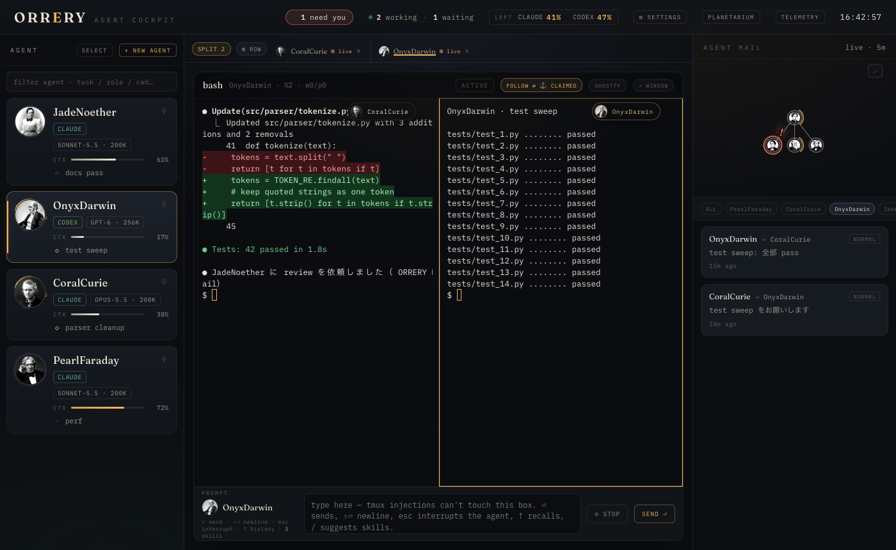

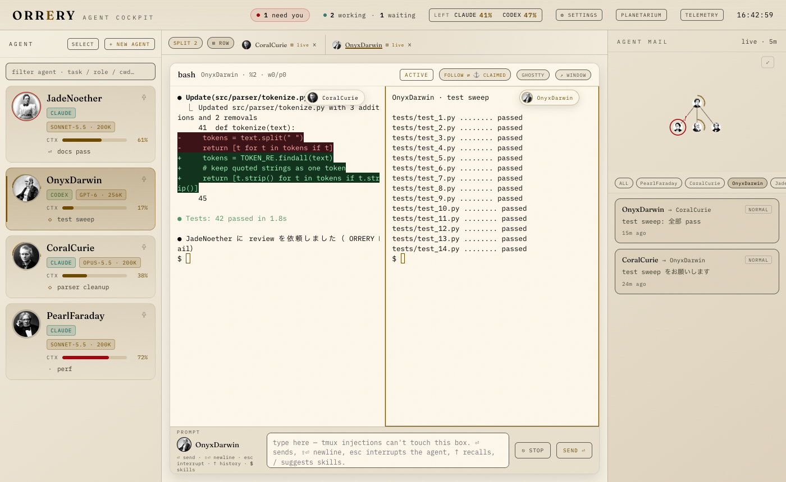


When you choose Light, the following switch together.

- The whole cockpit screen (the roster, terminal frames, Mail, the mini-orrery, Settings, and so on)
- **The colors inside the terminal**. Output from CLIs that color things assuming a dark background (such as the red and green backgrounds of a diff) is also corrected automatically to a depth at which the text is readable
- The embedded TELEMETRY (the cockpit sends it the same color scheme)
- In ORRERY.app, the window appearance and the Dock icon

`System` follows the OS appearance (light / dark) and follows on the spot when the OS switches. The chosen scheme is reflected in the other ORRERY.app and browser windows within a few seconds, like Settings.

### Vision profile

In Settings, `Vision profile · small text + tracking` lets you adjust small text and letter spacing.

- `P1 Small text`: makes UI text smaller than 12 px larger by up to +2 px
- `P2 Wide tracking`: sets the upper limit of letter spacing to 0.08 em (code parts excluded)

Each has five levels: `A` (no change), `.25`, `.5`, `.75`, and `1`, and the two can be used at the same time. `A · Current (no change)` restores the original. The change is also applied to the embedded TELEMETRY at the same time, so it cannot be applied while ORRERY Telemetry is stopped (`VISION PROFILE REJECTED` is shown and it reverts).

## Differences on Windows (WSL2)

When you run the backend in WSL2 and open it in a Windows-side browser, the cockpit asks the backend for its environment at startup (`/telemetry/platform`) and switches the following. Operations that are the same as on Mac work as they are.

| Item | Mac | Windows (WSL2) |
| --- | --- | --- |
| Jump palette | `Cmd+K` | `Alt+K` (the label at the top left of the palette also becomes `Alt+K`) |
| Switch between attached sessions | `Cmd+1`–`Cmd+9` | `Alt+1`–`Alt+9` |
| Add to Split | `Cmd` / `Ctrl` + click | `Ctrl` + click |
| Go to the end of the terminal | `Cmd+↓`, `↓ BOTTOM`, clicking the label again | `↓ BOTTOM`, clicking the label again (there is no key that corresponds to `Cmd+↓`) |
| Open a terminal outside | `GHOSTTY` (a Ghostty window) | `WIN TERMINAL` (attaches to the same tmux session in a new tab of Windows Terminal `wt.exe`) |
| Click a URL in a pane | The default browser | The Windows default browser (`wslview`, or `explorer.exe` if that is missing) |
| Click a path in a pane | Finder | Explorer (`explorer.exe`; the path is converted to Windows format with `wslpath`) |
| Pasting files | The path of a file copied in Finder | The path of a file copied in File Explorer (converted to a WSL path such as `/mnt/c/...` and inserted) |
| Pasting images | The TUI reads it from the Mac clipboard (`Ctrl+V` is forwarded) | The image, such as a screenshot, is saved as a PNG and its path is inserted |
| Standalone window | An ORRERY.app window (a popup in a browser) | A popup in the Windows browser (popups must be allowed) |

`Cmd` corresponds to the Windows key on Windows, which the OS uses, and `Ctrl+K` / `Ctrl+1`–`9` are used by the browser, so WSL uses `Alt`. `Alt+K` / `Alt+1`–`9` are received by the cockpit even when the terminal has focus, and are not sent to the agent.


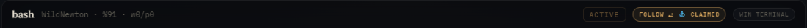

When `WIN TERMINAL` cannot be pressed, hovering over the button shows the reason (`wt.exe` is not on PATH, `WSL_DISTRO_NAME` is missing, and so on). If Windows Terminal is not installed, get it from the Microsoft Store. While the backend has not yet returned its environment, file / image pasting is held back so that a paste success is not shown by mistake.

### Pasting files and images on WSL

The WSL backend reads the Windows clipboard with `powershell.exe` (Windows PowerShell).

- Copy a file in File Explorer and press `Ctrl+V` in the composer, and the path of that file is inserted. A Windows path (`C:\Users\...`) is converted to a WSL path (`/mnt/c/Users/...`) with `wslpath -u`. Japanese file names are inserted as they are.
- If some of several files cannot be converted to a WSL path (for example a network path such as `\\server\share`), only the ones that could be converted are inserted, and the names of the rest are shown at the bottom right of the screen.
- When you paste a screenshot (`Win+Shift+S` and so on), the image is saved as a PNG in `/tmp/orrery-clipboard-<uid>/` and its path is inserted. The agent can read the image at that path. The folder and the images are given permissions readable only by you (0700 / 0600). You can change the location with the environment variable `ORRERY_CLIPBOARD_DIR` (an absolute path). The newest 50 images are kept, and older ones are deleted.
- PowerShell is started for every paste, so you may wait a little before the path is inserted.

When pasting does not work, the reason is shown at the bottom right of the screen.

| Message | Meaning |
| --- | --- |
| `... cannot reach powershell.exe` | WSL cannot call a Windows program (for example interop is disabled). `file_paste` in `/telemetry/platform` becomes `false` |
| `clipboard reader failed (clipboard_no_session)` | The PowerShell started from the backend is running in a Windows session with no desktop (session 0). This can happen when the backend is started from outside the logged-in screen, such as over ssh. Restart the backend from WSL inside the logged-in screen, such as Windows Terminal |
| `clipboard reader failed (clipboard_unreadable)` | PowerShell could not read the clipboard (the reason appears in the backend log), the image could not be saved, or none of the copied files could be converted to a WSL path |

## How Codex App is handled

ORRERY does not read Codex App snapshots directly. It shows the rows that the optional ORRERY Telemetry Codex App Bridge has merged into the dashboard `/api/agents`.

The Codex App runtime has no tmux pane, so you cannot type into it from the cockpit terminal. The embedded dashboard uses only the `open` capability that brings the ChatGPT app to the front, and does not perform EXIT, KILL, wake, or terminal attach. Cold wake and delivery are managed by the Bridge.

## Related documents

- [Installation](install.md)
- [Configuration](configuration.md)
- [Troubleshooting](troubleshooting.md)
- [Architecture overview](ARCHITECTURE_OVERVIEW.md)
- [Implementation architecture](ARCHITECTURE.md)
- [Design language](DESIGN.md)
